# Connect Analytics Cloud to HANA on SAP Cloud Platform
<!-- description --> Create a live data connection from SAP Analytics Cloud to the SAP Cloud Platform using single sign-on (SSO).

## Prerequisites  
 - **Proficiency:** Beginner

## You will learn  
  - Assign roles in SAP HANA
  - Configure trust between SAP HANA and SAP Analytics Cloud
  - Create data connection between SAP HANA and SAP Analytics Cloud

## Intro
The SAP Cloud Platform not only provides an environment for the development of new applications, but also allows you to extend existing cloud and on-premise systems. And by connecting an SAP HANA database (in SAP Cloud Platform) with SAP Analytics Cloud, you have advanced analytics and business intelligence features for your enterprise data.

In this tutorial, you'll create a live data connection from SAP Analytics Cloud to SAP Cloud Platform using SSO. "Live" data means that whenever a user opens a story in SAP Analytics Cloud, any changes to the data in the source system are immediately reflected in SAP Analytics Cloud.  

After creating the live data connection, you can create models, on top of which you can build stories in which users can consume live data from your SAP HANA system.

For full documentation, see the Live Data Connection to SAPCP with SSO.
## System requirements
You must be using one of the following systems:

  - SAP HANA 1.0 SPS10, revision 102.2
  -	SAPCP running on SAP HANA SPS10, revision 1.02.2
  -	SAP HANA 2.0 SP01 or newer

If you use a system with SAP HANA version SPS10 or higher, verify that the Info Access Service is installed. If the SAP HANA Info Access Service is not installed, import the Info Access Toolkit and the SINA API, and then import the Info Access Service. You need access to the SAP Software Download Center to download the necessary delivery units. For further information, see [Installing the Info Access, Toolkit, API, and Service](https://help.sap.com/viewer/691cb949c1034198800afde3e5be6570/2.0.00/en-US/ced0ed08bb5710149a3afa33375c7fd0.html).
## Information you will need
<table>
  <tr>
    <td rowspan="2">XS ADMIN Tool in your SAP HANA system</td>
    <td>SAML Service Provider</td>
    <td>In the XS ADMIN Tool, do the following:
      <ol>
        <li>Click   and select SAML Service Provider.</li>
        <li>In the Service Provider Information (a), copy the text following Name.
        This is the name of the SAML Service Provider. (b).</li>
      </ol>
    </td>
  </tr>
  <tr>
    <td>SAP HANA IdP</td>
    <td>In the XS ADMIN Tool, do the following:
      <ol>
      <li>Click  and select SAML Identity Provider.</li>
      <li>In the Destination section, copy the Base URL.</li>
      </ol>
    </td>
  </tr>
  <tr>
    <td rowspan="3">SAP Cloud Platform Cockpit</td>
    <td>SAP Cloud Platform Account </td>
    <td>Available in the Global Account > Subaccounts in the Subaccount Information under Name 
    </td>
  </tr>
  <tr>
    <td>Database Name</td>
    <td>Available in Databases & Schemas under DB/Schema ID 
    </td>
  </tr>
  <tr>
    <td>Landscape Host</td>
    <td>Available in the Region page title 
    </td>
  </tr>
  <tr>
    <td>SAP Analytics Cloud</td>
    <td>Cloud identity</td>
    <td>Available in Profile Management > Profile > Personal Information under User ID.
    </td>
  </tr>
</table>

## Time to Complete
**30 Min**

---

### Assign roles to HANA administrator

The SAP HANA administrator account must be assigned the following roles:

  - `sap.hana.xs.admin.roles::SAMLAdministrator`
  - `sap.hana.xs.admin.roles::RuntimeConfAdministrator`
  - `sap.hana.ide.roles::CatalogDeveloper`
  - `sap.hana.ide.roles::SecurityAdmin`

Verify these roles are assigned, and assign them if needed.

1.	Open SAP HANA Studio.
2.	In the Navigator, go to **Security** > **Users** > **[HANA Admin Name]** (in this example **SYSTEM**), and then go to the **SYSTEM** tab.
The assigned roles to the HANA administrator account appear in the **Granted Roles** list.
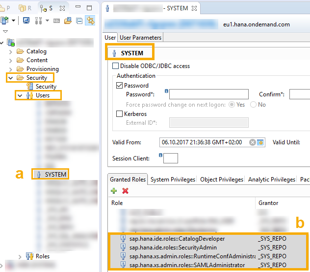
3.	Verify that the needed roles (in the list above) appear.
4.	To grant a missing role, click .
5.	In the **Select Roles** screen, enter the name of the role, select the role from the list, and click **OK**.

The role is added to the **Granted Roles** list.

### Assign roles to HANA users

Assign the **Info Access Service** role (`sap.bc.ina.service.v2.userRole::INA_USER`) to all users who will use the live connection.

1.	Open the SAP HANA Web-based Development Workbench.
2.	In the **Security** section, go to **Security** > **Users**.
3.	Select the user that represents the HANA live data connection user (a).

4.	In the **User** tab, in the **Granted Roles** tab, and click .
5.	In the **Select Roles** window, enter enough of the following Info Access Service role text so that it appears in the list:
 `sap.bc.ina.service.v2.userRole::INA_USER`
6.	Select this role and click **OK**.
The role is added to the **Granted Roles** list (b).


### Set up trust in SAC

Set up a trust relationship using an identity provider (IdP) that links user accounts in the SAP HANA and SAC systems, so that data is exchanged without the need for exchanging user credentials.

The default IdP for SAC is the SAP Cloud Platform Identity Authentication Service, and this IdP will be used for user authentication and authorization in the SAP HANA system.

1.	Open and log onto SAP Analytics Cloud.
2.	Click  and then select **Connection**.
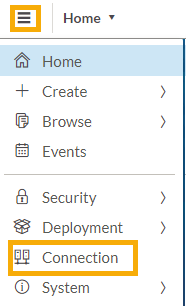
3.	In the **Connection** page, under **Connections**, click   to add a connection (a).
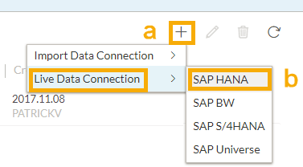
4.	From the **Live Data Connection** list, choose **SAP HANA** (b).
5.	In the **New HANA Live Connection** box, do the following:

    | Field | Value |
    |-------|-------|
    | **Name** | `HanaConn` |
    | **Description** | `Live Connection to HANA` |
    | **Connection Type** | `SAP Cloud Platform` |
    | **SAP Cloud Platform** <br> **Database Name** <br> **Landscape Host** | This information can be found in your SAP Cloud Platform Cockpit. For information on where to locate it, refer to the tutorial prerequisites. |
    | **Default Language** (Optional)|  Once you have clicked **OK** to save the live connection, the default language can only be changed by the administrator. If the language you choose is not installed on your SAC system, SAC will choose the default language. |

    Under **Credentials**, do the following:
    <ol type="a"><li>Select **SAML Single Sign-On** (a) from the list.
    </li><li>Click **Download Metadata** (b) and save the metadata file locally. You'll need it in the next step.
    </li><li>In the **SAML Provider Name** box, enter the name of the service provider (c) you copied into a temporary text file earlier.
    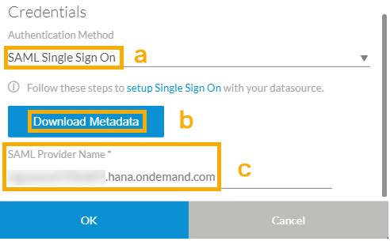</li></ol>

>**Important:** **Do not click OK yet**, as you are not yet authorized to access the SAP HANA system. You must keep this dialog box and browser page open until you are instructed to click **OK** farther along in the tutorial. If it is closed by accident, you will have to repeat these steps.

### Set up trust in HANA

Use Security Assertion Markup Language (SAML) for exchanging authentication and authorization data between the service providers and the IdP.

1.	Open the XS ADMIN Tool in your SAP HANA system using the following address:
`https://[SAP HANA system]/sap/hana/xs/admin`
where `[SAP HANA system]` is the name of your SAP HANA system.
2.	Click  and select **SAML Identity Provider**.
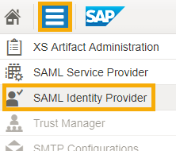
3.	Click  in the bottom left corner.

4.	Open the metadata XML file that you downloaded from the **New HANA Live Connection** box, copy the contents of the file, and in the XS Admin Tool paste the text into the **Identity Provider Metadata** field.
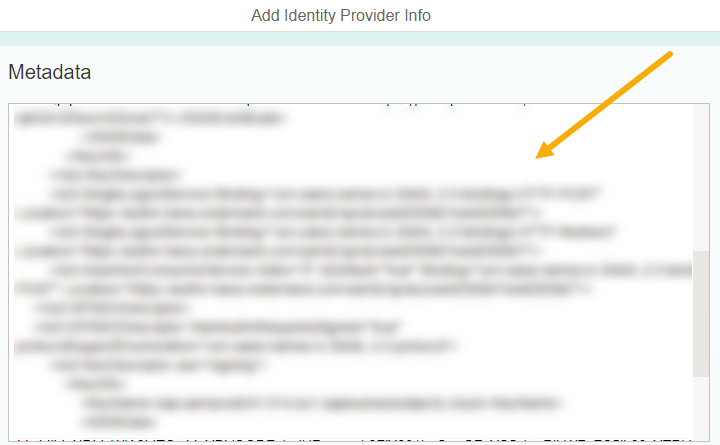
5.	In the **General Data** (a) section, enter the your SAML IdP in the **Name** field (b).
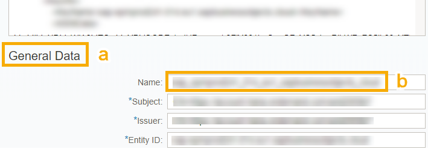
    >Keep this name handy because you will need it later.

6.	In the **Destination** section (a), in both the **`SingleSignOn URL (Redirect Binding)`** and **`SingleSignOn URL (PostBinding)`** fields (b), enter the following path:
`/saml2/sso`

7.	Click **Save**.

Your HANA system is now configured to trust connections established from SAC.

### Enable SAML authentication


1.	In the XS ADMIN Tool in your SAP HANA system, click  and select **XS Artifact Service Provider**.
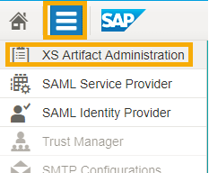
2.	In the **Packages** list (a), use the arrow icon (b) to navigate to **sap** > **bc** > **`ina`** > **service** > **`v2`**.
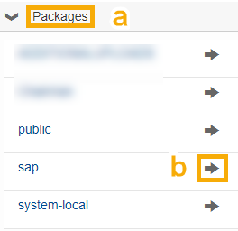
To verify that you have navigated to the correct directory (a), click **`v2`** (b) to see its security administration page (c).

3.	Click **Edit** in the bottom-right corner of the **Runtime Configuration Details** window.

4.	Select the **SAML** checkbox, if it is not already enabled (a).
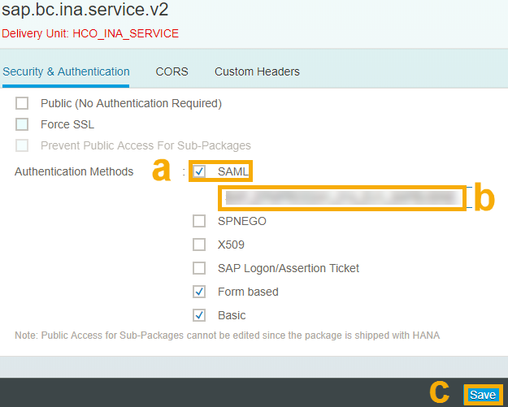
5.	Select from the **SAML** text box (b) and enter the name of the IdP you entered in the **XS ADMIN Tool** > **SAML Identity Provider** > **General Data** in the previous step.
6.	Click **Save** (c).

Now that you have enabled the SAML authentication, you will map users to access your SAP HANA database using SSO. Do one of the following two steps based on which IdP you use:

  - If you will use the same IdP for SAP HANA and SAC, you can automatically map all existing users to access your SAP HANA database from SAC.
  - If you will use different IdPs for SAP HANA and SAC, you must perform a manual user mapping.

### Map users - automatic

You can perform an automatic user mapping if you are using the same IdP for SAP HANA and SAC.

1.	Open the SAP HANA Web-based Development Workbench using the following address:
`https://[SAP HANA SYSTEM]/sap/hana/ide/catalog/`
where `[SAP HANA SYSTEM]` is the name of your SAP HANA system.
2.	In the **Catalog** section, from the  menu, click **New** > **Schema**.
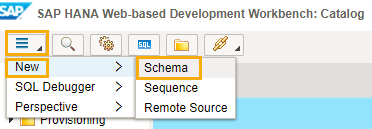
3.	In the **Create New Schema** box, enter a name for the schema (a) and click **OK** (b).
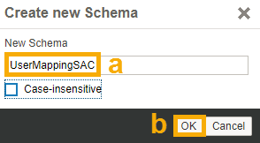
4.	Click  to open the SQL Console (a).
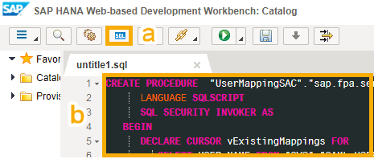
5.	In the text box (b), paste the following procedure.
    >**Important:** In the procedure, replace `[MYSCHEMA]` with the name of the schema you have created (in the screenshots, it appears as `UserMappingSAC`).

    ```sql
    CREATE PROCEDURE  "[MYSCHEMA]"."sap.fpa.services::mapIdentityFromIdpToIdp" (IN FROM_IdP VARCHAR(2048), TO_IdP VARCHAR(2048))
          LANGUAGE SQLSCRIPT
          SQL SECURITY INVOKER AS
       BEGIN
          DECLARE CURSOR vExistingMappings FOR
             SELECT USER_NAME FROM "SYS"."SAML_USER_MAPPINGS" WHERE SAML_PROVIDER_NAME = TO_IdP;
          DECLARE CURSOR vUserSamlMappings FOR
             SELECT USER_NAME, SAML_PROVIDER_NAME, EXTERNAL_IDENTITY FROM "SYS"."SAML_USER_MAPPINGS";
          FOR cur_row AS vExistingMappings DO
             EXECUTE IMMEDIATE 'ALTER USER '||:cur_row.USER_NAME||' DROP IDENTITY FOR SAML PROVIDER '||:TO_IdP||'';
          END FOR;
          FOR cur_row AS vUserSamlMappings DO
             IF cur_row.SAML_PROVIDER_NAME = FROM_IdP THEN
                EXECUTE IMMEDIATE 'ALTER USER '||:cur_row.USER_NAME||' ADD IDENTITY '''||:cur_row.EXTERNAL_IDENTITY||''' FOR SAML PROVIDER '||:TO_IdP||'';
             END IF;
          END FOR;
    END;
    ```

6.	Execute the procedure by doing one of the following:

    - Press F8.
    - Click  .

7.	Replace the SQL Console text with the following command:

    ```sql
    CALL "[SCHEMA]"."sap.fpa.services::mapIdentityFromIdpToIdp"('[LOGIN IdP]', '[IMPORTED IdP NAME]');
    ```

    where:

      - `[SCHEMA]` represents the selected schema name (in the screenshot example, it appears as `UserMappingSAC`)
      - `[LOGIN IdP]` represents the name of the SAP HANA IdP. To find this name, refer to the tutorial prerequisites.
      - `[IMPORTED IdP NAME]` represents the name of the SAC IdP you noted down in a previous step.
8.	Execute the SQL statement by pressing **F8** or clicking .

### Map users - manual

If you are using different IdPs for SAP HANA and SAC, you will perform a manual user mapping using SSO.

1.	In the SAP HANA Web-based Development Workbench, go to the **Catalog** section.
You can access this section using the following address:
`https://[SAP HANA SYSTEM]/sap/hana/ide/catalog/`
where `[SAP HANA SYSTEM]` is the name of your SAP HANA system.
2.	Click  to open the SQL Console (a).
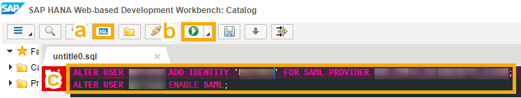
3.	Paste in the text box (c) the following procedure:

    ```
    ALTER USER [HANA USER ID] ADD IDENTITY '[SAML MAPPING]' FOR SAML PROVIDER [IMPORTED IdP NAME];
    ALTER USER [HANA USER] ENABLE SAML;
    ```
    where:

      - `[HANA USER ID]` represents the user ID of the HANA user that will use the live data connection. To find this name, refer to the tutorial Prerequisites.
        >You must be logged in to your HANA system with a user that is different from the user who appears in the SQL statement (i.e., `[HANA USER]`) because users are not able to alter the second statement for themselves.
      - `[SAML MAPPING]` represents the cloud identity. To find this name, refer to the tutorial Prerequisites.
      - `[IMPORTED IdP NAME]` represents the name of the SAC IdP you noted down in step 11.

4.	Execute the procedure by pressing **F8** or clicking  (b).

### Save connection in SAC

1.	In SAP Analytics Cloud, return to the **New HANA Live Connection** box.
    >If the **New HANA Live Connection** box was closed by accident, repeat New HANA Live Connection steps in XXXX.

2.	Click **OK**.
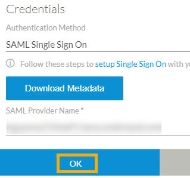


You have defined a live data connection and can start creating models using this connection.

In the following screenshot, you can see a sample story that consumes live data and shows the pipeline of the S/4HANA product for all regions.
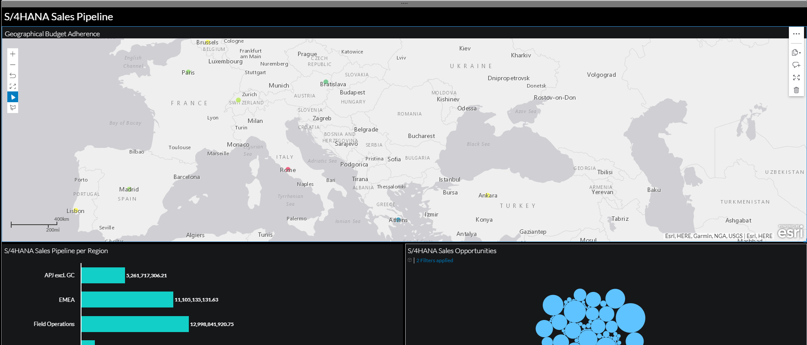


---
