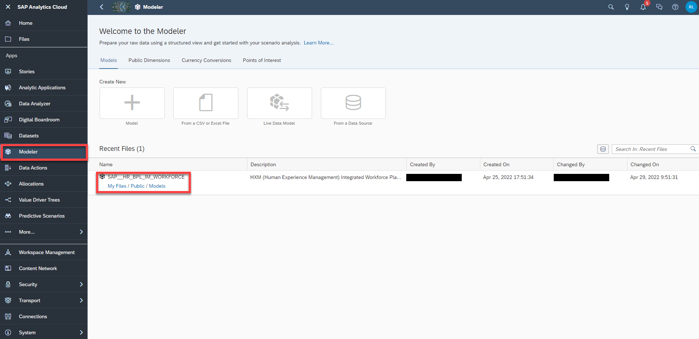
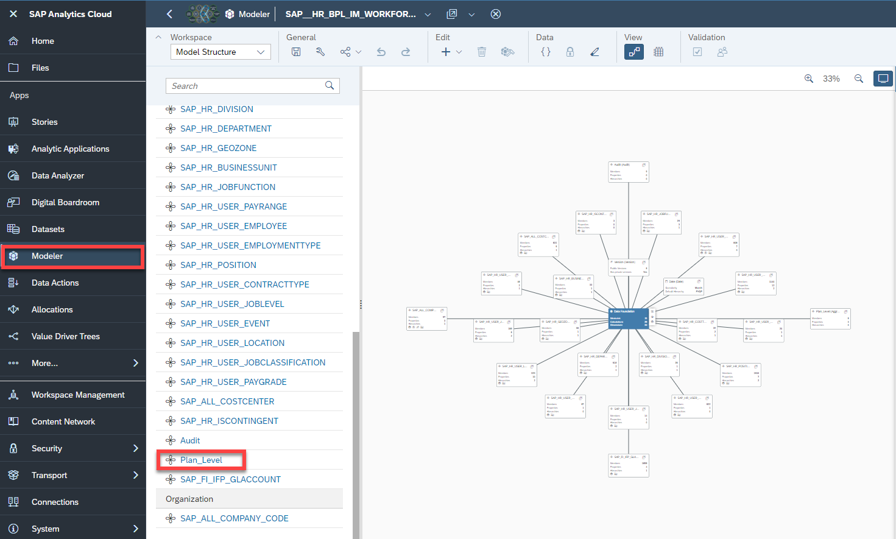
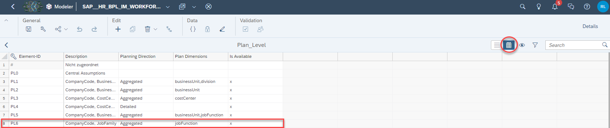

# SAC HXM Content: Add a new Plan Level
<!-- description --> This tutorial provides information about how to add a new Plan Level

## Prerequisites
 - You have installed the Human Resources - HXM Operational Workforce Planning Content Package for SAP Analytics Cloud
 - Find out everything you need to know about the HXM Content Package on our community page [Extended Planning & Analysis Business Content](https://community.sap.com/topics/cloud-analytics/planning/content?source=social-Global-SAP+Analytics-YOUTUBE-MarketingCampaign-Analytics-Analytics-spr-5330779922)

## You will learn
  - Which steps are required in order to add a new Plan Level to the HXM Content Package


---

### Add new Member to Plan Level Dimension


In the first step, it is necessary to add a new Member to the **Plan Level** Dimension.
The Plan Level describes the high level point of view used for the planning activities.
In this example, you will add a new Plan Level which enables the Planner to perform planning activities on a `Company Code + Job Family` level.


1. 	In the SAP Analytics Cloud menu, navigate to the **Modeler**.

2. Open the `SAP__HR_BPL_IM_WORKFORCE` data model.



3.  Click on the Dimension `Plan_Level`.



4.  Add a new Member to the Plan Level dimension.

In this example, the Plan Level `PL6` representing a `Company Code + Job Family` point of view is added.

- Make sure to active the grid mode (button marked on top right corner).
- Add the according attributes to the new Element-ID
|  Column             | Value                         | Comment
|  :----------------- | :---------------------------- | :----------------------------------------------------------------------------------------
|  Element-ID         | `PL6`                         | Mandatory ID field
|  Description        | `CompanyCode, JobFamily`      | Description of the new Plan Level Member
|  Planning Direction | `Aggregated`                  | Mandatory Field. Shows whether this Plan Level is applied to the Aggregated or Detailed Planning Scenario
|  Plan Dimensions    | `jobFunction`                 | Mandatory Field. Please make sure to add the dimensions in camel case naming convention
|  Is Available       | `x`                           | Outdated. Does not need to be maintained.



5. Save your changes.


### Modify Version Dimension


In the next step, the `Version` Dimension needs to be modified.
Here you will set the new Plan Level `PL6` as the default point of view for the `Aggregated_Plan` Version.
Doing this, your analytic applications will automatically initialize all planning grids according to the settings you set in Step 1.

1. 	Navigate back to the Model Structure and click on the Dimension `Version`.

2.  Change the value for the `public.Aggregated_Plan` Version in the attribute `Plan_Level` to `PL6` in order for the application to initialize accordingly.

3.  Save your changes.


### Adjust Data Actions


In the next step, all affected Data Actions must be adjusted in order to make calculations for the new Plan Level `PL6`work.

1.  Navigate to the Data Action Menu and open the Data Action `SAP__HR-BPL_IM_INITIALIZE_PLAN_WITH_AGGREGATION`.


2.  Click on the second Data Action step **Seeding Internal** and complement the code with the following statement by adding these lines at the very end of the Data Action step:

```
ELSEIF @PlanLevelNumeric = 6 THEN

//Aggregate all data from the specified ReferencePeriod of the Actual Version to CompanyCode/JobFunction (PL6) level and copy these values to the dates of the planning horizon (specified in Memberset)
//Hint: Specify all dimensions except for CompanyCode/JobFunction
DATA([d/Plan_Level] = "PL6",
	 [d/SAP_HR_ISCONTINGENT] = "false",
	 [d/Audit] = "INIT",
	 [d/SAP_HR_USER_EMPLOYEE] = "#",
	 [d/SAP_HR_POSITION] = "#",
// [d/SAP_ALL_COMPANY_CODE] = "#",
   [d/SAP_HR_BUSINESSUNIT] = "#",
	 [d/SAP_HR_DIVISION] = "#",
	 [d/t.S:SAP_ALL_COSTCENTER] = "#",
   [d/t.S:SAP_HR_USER_PAYGRADE] = "#",
	 [d/t.S:SAP_HR_USER_JOBCLASSIFICATION] = "#",
	 [d/SAP_HR_DEPARTMENT] = "#",
	 [d/SAP_HR_USER_LOCATION] = "#",
	 [d/SAP_HR_USER_EVENT] = "#",
	 [d/SAP_HR_USER_EMPLOYMENTTYPE] = "#",
	 [d/SAP_HR_USER_JOBLEVEL] = "#",
	 [d/SAP_HR_USER_CONTRACTTYPE] = "#",
	 [d/SAP_HR_GEOZONE] = "#",
	 [d/SAP_HR_USER_PAYRANGE] = "#",
// [d/SAP_HR_JOBFUNCTION] = "#",
	 [d/SAP_FI_IFP_GLACCOUNT] = "#"
	 ) = RESULTLOOKUP([d/Version] = "public.Actual", [d/Date] =  [d/Version].[p/ReferencePeriod])

ENDIF
```

Your result should look like this:


>EXPLANATION: How to modify the Data Action:
- In order to make cost calculations for Plan Level "PL6" work, add a new ELSEIF statement as shown in the image above.
- For simplification reasons, you can copy one code block from any other Plan Level and paste it at the bottom of the Data Action step.
 - If you do this, make sure to change the commented lines accordingly.
 - In this example, the dimensions `[d/SAP_ALL_COMPANY_CODE]` and `[d/SAP_HR_JOBFUNCTION]` must be commented as they are part of the definition of Plan Level `PL6`.

3.  Repeat the same Activity for the third Data Action Step **Seeding External**.

```
ELSEIF @PlanLevelNumeric = 6 THEN

//Aggregate all data from the specified ReferencePeriod of the Actual Version to CompanyCode/JobFunction (PL6) level and copy these values to the dates of the planning horizon (specified in Memberset)
//Hint: Specify all dimensions except for CompanyCode/JobFunction
DATA([d/Plan_Level] = "PL6",
  [d/SAP_HR_ISCONTINGENT] = "true",
  [d/Audit] = "INIT",
  [d/SAP_HR_USER_EMPLOYEE] = "#",
  [d/SAP_HR_POSITION] = "#",
//[d/SAP_ALL_COMPANY_CODE] = "#",
  [d/SAP_HR_BUSINESSUNIT] = "#",
  [d/SAP_HR_DIVISION] = "#",
  [d/t.S:SAP_ALL_COSTCENTER] = "#",
  [d/t.S:SAP_HR_USER_PAYGRADE] = "#",
  [d/t.S:SAP_HR_USER_JOBCLASSIFICATION] = "#",
  [d/SAP_HR_DEPARTMENT] = "#",
//[d/SAP_HR_USER_LOCATION] = "#",
  [d/SAP_HR_USER_EVENT] = "#",
  [d/SAP_HR_USER_EMPLOYMENTTYPE] = "#",
  [d/SAP_HR_USER_JOBLEVEL] = "#",
  [d/SAP_HR_USER_CONTRACTTYPE] = "#",
  [d/SAP_HR_GEOZONE] = "#",
  [d/SAP_HR_USER_PAYRANGE] = "#",
//[d/SAP_HR_JOBFUNCTION] = "#",
  [d/SAP_FI_IFP_GLACCOUNT] = "#"
) = RESULTLOOKUP([d/Version] = "public.Actual", [d/Date] =  [d/Version].[p/ReferencePeriod])

ENDIF
```


4.  Save your Data Action.


### Maintain Central Assumptions for new Plan Level


Lastly it is required to maintain Central Assumptions for the Plan Level `PL6`.
Here you can access the tutorial [Maintain Central Assumptions](sac-content-hxm-maintain-central-assumptions) in order to learn how to upload and maintain Central Assumptions.
Interested in more XP&A related topics and Business Content Packages related to it? Visit our community page here: [Extended Planning & Analysis Business Content](https://community.sap.com/topics/cloud-analytics/planning/content?source=social-Global-SAP+Analytics-YOUTUBE-MarketingCampaign-Analytics-Analytics-spr-5330779922).


---
