# Run Your Automated Table Maintenance
<!-- description --> No need to do everything on your own. Use ATM for automation.

## Prerequisites
- You have successfully set up the SAP developer trial system.

## You will learn
  - How to utilize the Automatic Table Maintenance (ATM) tool

## Intro
The ATM framework is a useful tool to keep your tables organized and your statistics up to date.

Here's a scenario: You want set up a time window on Wednesday night, in which ATM shall perform maintenance on specific tables, in order to provide updated table statistics in the afternoon.

>This tutorial only touches on parts of the ATM framework. If you want to learn more, see [DBA Cockpit: Automatic Table Maintenance for SAP Adaptive Server Enterprise](https://archive.sap.com/kmuuid2/00a022d1-dce2-2e10-e687-f4903ed95a54/DBA%20Cockpit%3A%20Automatic%20Table%20Maintenance%20for%20SAP%20Adaptive%20Server%20Enterprise.pdf).

---

### Open the ATM interface

1. Launch the Transaction `DBACOCKPIT`.

     

2. Open the ATM Interface by clicking **Database NPL** > **Configuration** > **Automatic Table Maintenance**.

     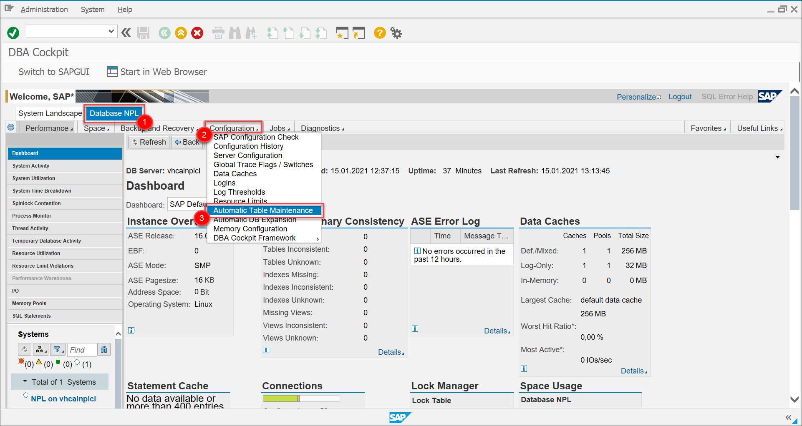

### Create a new time window

In the current tab "Maintenance Windows", you can see two Windows, these are provided by default. If these don't fit your needs, you will have to create your own custom time window, which you will do in this step.

1. Click on **Create** to create a new time Window.

    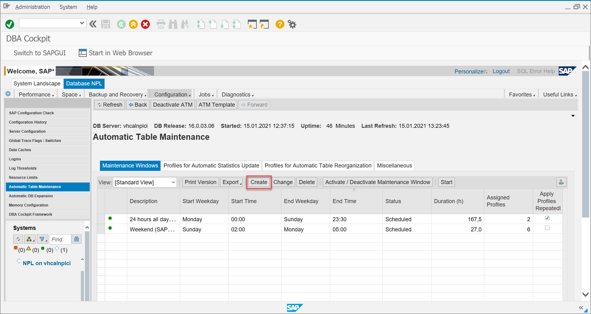

2. Set it up to run in the desired time frame and click **Save**.

    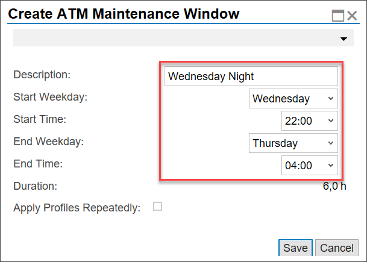
    &nbsp;

    |  Field Name     | Value
    |  :------------- | :-------------
    |  Description           | **Wednesday Night**
    |  Start Weekday           | **Wednesday**
    |  Start Time    | **22:00**
    |  End Weekday          | **Thursday**
    |  End Time   | **04:00**

3. You should now see the freshly created time window in the list. **Select** it and activate it by clicking **Activate/Deactivate Maintenance Window**.

    If you are doing this tutorial on a Wednesday night, you need to start the window manually by clicking **Start**. If not, the window will automatically start on next Wednesday night.

    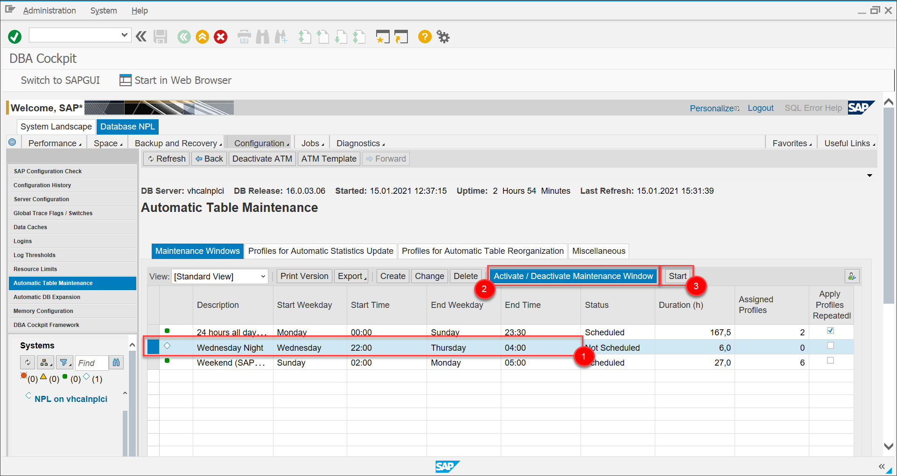

### Create new statistics profile

In this step, you will create a new statistics profile.
This profile will define which tables will have their statistics updated, when the profile is executed.

For this scenario, you only want small sized tables to be updated, since the larger tables are updated on weekends.

1. Click **Profiles for Automatic Statistics Update**. To create a new Profile, click **Create**.

    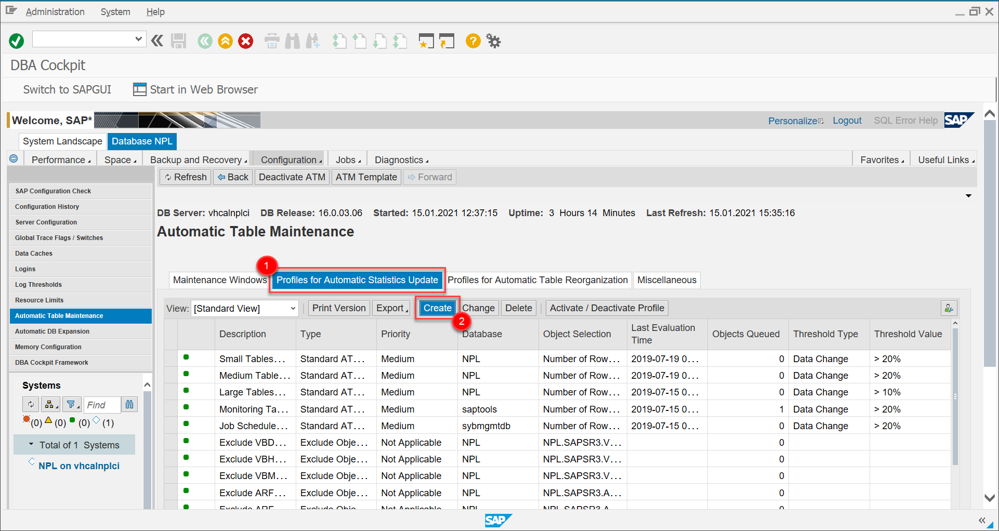

2. Define the profile to your likings, afterwards click **Save**.

    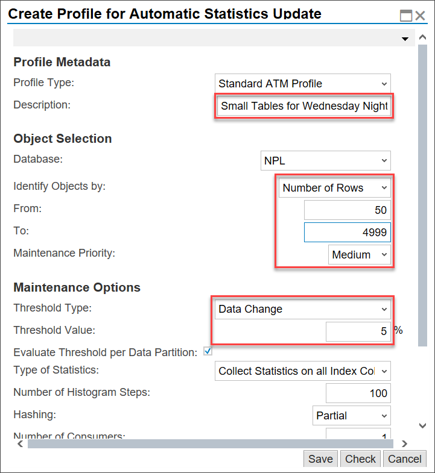
&nbsp;

    |  Field Name     | Value
    |  :------------- | :-------------
    |  Description           | **Small Tables for Wednesday Night**
    |  Identify Objects by           | **Number of Rows**
    |  From    | **50**
    |  To          | **4999**
    |  Threshold Type   | **Data Change**
    |  Threshold Value | **5**

      This will update the statistics of all tables that have between 50 and 4999 rows and whose data has been changed by a marginal amount.

3. Activate the profile by first selecting it, followed by clicking **Activate / Deactivate Profile**.

### Create new reorganization profile

In this step, you will create a new reorganization profile.
This profile will define which tables will be reorganized, when the profile is executed.

1. Click **Profiles for Automatic Table Reorganization**. To create a new Profile, click **Create**.

    

2. Define the profile to your likings, afterwards click **Save**.

    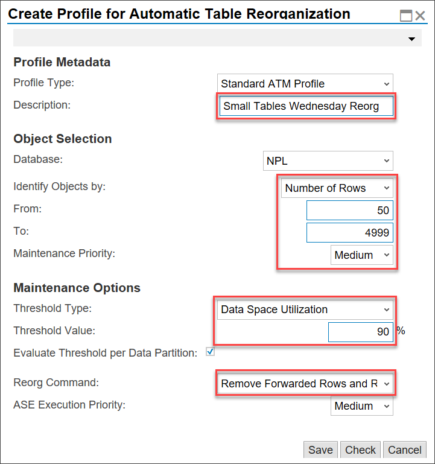
    &nbsp;

    |  Field Name     | Value
    |  :------------- | :-------------
    |  Description           | **Small Tables Wednesday Reorg**
    |  Identify Objects by           | **Number of Rows**
    |  From    | **50**
    |  To          | **4999**
    |  Threshold Type   | **Data Space Utilization**
    |  Threshold Value | **90**
    |  Reorg Command | **Remove Forwarded Rows and Reclaim Space (Compact)**

3. Activate the profile by first selecting it, followed by clicking **Activate / Deactivate Profile**.

### Assign profiles to time window

In this step, you will assign the profiles that you just created to a maintenance window. This will automatically execute the profile.

1. Switch back to the **Maintenance Window** tab and select the Window you previously created (In this case, **Wednesday Night**)

2. Scroll down to find the list of assigned profiles and click **Add**.

    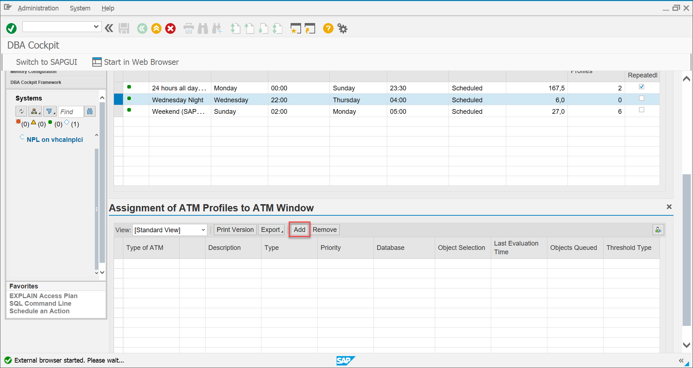

3. In the list that you are presented, scroll down until you find one of your created profiles. Afterwards click **Add**.

    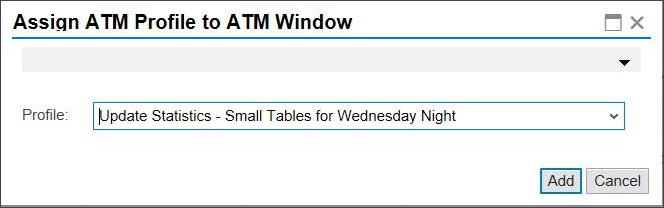

4. Following the same procedure, add the other profile that you created.

5. You should now be able to see the two profiles in the list:

    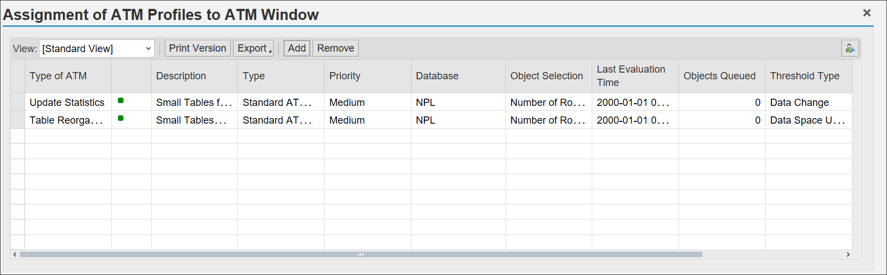

### Monitor ATM framework

Navigate to **Diagnostics > Automatic Table Maintenance**. You will see three options:

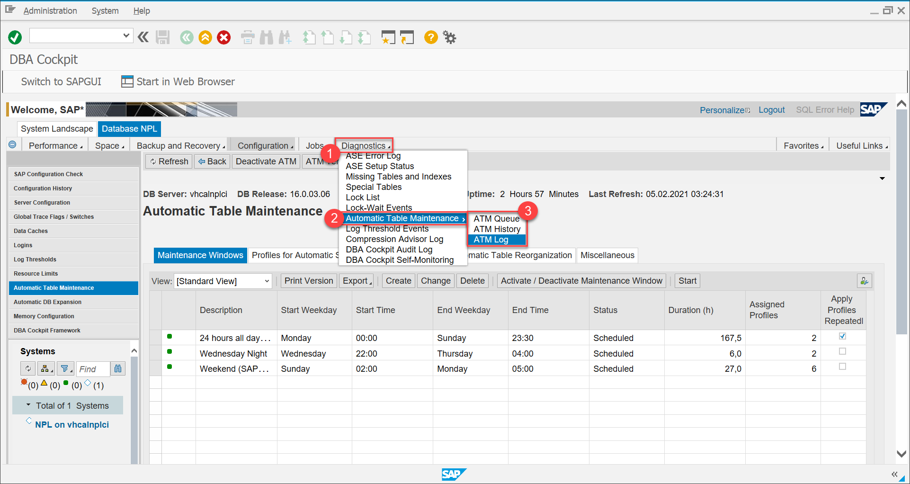

* [**ATM Queue**](https://help.sap.com/viewer/52f8de9cc8d44dc39ad7c49299dd9f1f/02/en-US/84fe4e520b68d030e10000000a44538d.html) holds objects that require Maintenance.

* [**ATM History**](https://help.sap.com/viewer/52f8de9cc8d44dc39ad7c49299dd9f1f/02/en-US/4ffc4e520b68d030e10000000a44538d.html) shows all maintenance operations that have been executed by ATM in the previous days and weeks. This information allows you to fine-tune your ATM configuration and to ensure correct behavior of ATM in the respective application environment.

* [**ATM Log**](https://help.sap.com/viewer/52f8de9cc8d44dc39ad7c49299dd9f1f/02/en-US/01014e520b68d030e10000000a44538d.html) can help database administrators understand error conditions and performance-related issues.

>Your developer trial system is likely to not have many entries in the ATM Queue, if any at all. If not a lot of data changes, threshold values are rarely reached.*

---
