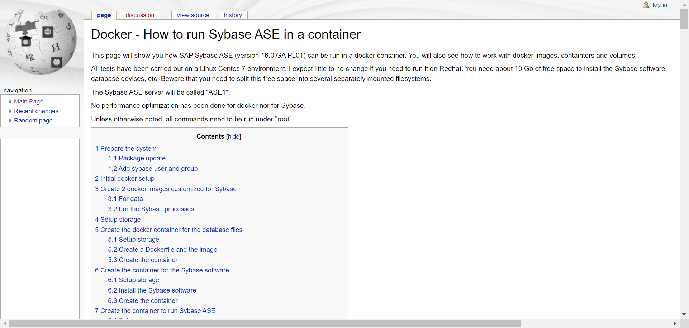
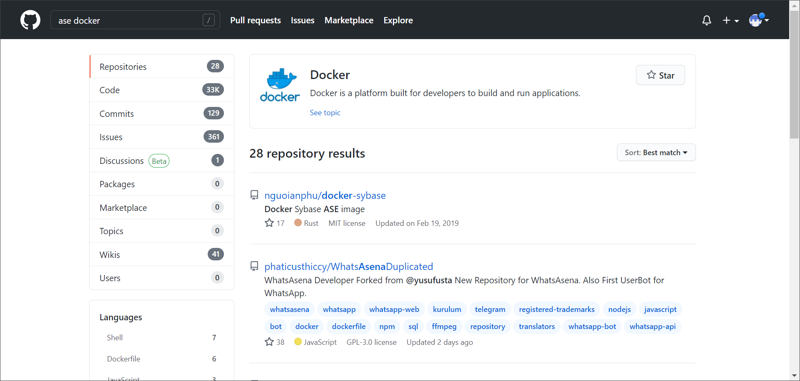

# Learn SAP ASE from the SAP Community
<!-- description --> Sharing is caring. Learn how others built their SAP ASE containers.

## You will learn
  - How to search for and find information on the SAP ASE database

## Intro
In this tutorial, you will revisit the different spots where you can find information about SAP ASE and generally stay up to date.

---

### Check the SAP Community

Check the [SAP Community site](https://community.sap.com/topics/applications-on-ase) to pick up on the latest SAP ASE news, blog posts, versions and documentation that you might have missed while doing this mission.

### Check legacy Sybase wiki

One page worth mentioning is the [Legacy Sybase Wiki](http://www.petersap.nl/SybaseWiki/index.php/Main_Page). Here you can find information on several products, amongst them is SAP ASE.

There also is information on [running SAP ASE in Docker](http://www.petersap.nl/SybaseWiki/index.php/Docker_-_How_to_run_Sybase_ASE_in_a_container)

>**Tip for your internet searches:** A lot of blog post refer to "Sybase ASE", and not "SAP ASE".

### Up-to-date information: GitHub!

Where else would you find the latest and greatest information, were it not for GitHub.

In GitHub, search for "ASE" and "Docker" and have a look at the [result list](https://github.com/search?q=ase+docker).

Which GitHub project is most relevant for you?

### Your next steps

And now? What could be your next step?

You can create your very own, personal project with SAP ASE: you could set up a developer system and test your ABAP programming skills. You can even write your own blog post about your project in the SAP Community!

---
