# Monitor and Administer the Database with DBA Cockpit.
<!-- description --> Monitor and administer the database with DBA Cockpit.

## Prerequisites
 - You have successfully set up the SAP developer trial system.

## You will learn
  - The fundamentals of the DBA Cockpit

## Intro
For more information on the DBA Cockpit, refer to [this document](https://help.sap.com/viewer/52f8de9cc8d44dc39ad7c49299dd9f1f/02/en-US/42cc5d7f19844d20aed0de2ef633908c.html).

---

### Make sure you can connect to your database

In this step, you will set up the database users to be able to connect to your database.

1. Open a new terminal in your host OS. Switch to user **`npladm`** by entering `su - npladm` followed by your **password**. After that, **execute** `sybxctrl set_sapsa_passwd` and **follow the instructions** given to you, to create a new password for database user *`sapsa`*.

    >The old password is the master-password you set up during installation.

    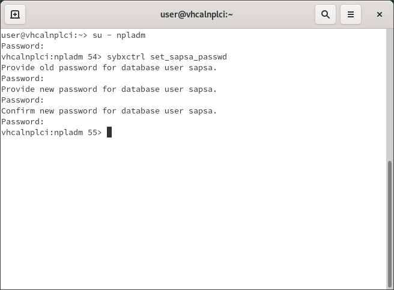

2. In the SAP System, launch the Transaction `DBACOCKPIT`.

     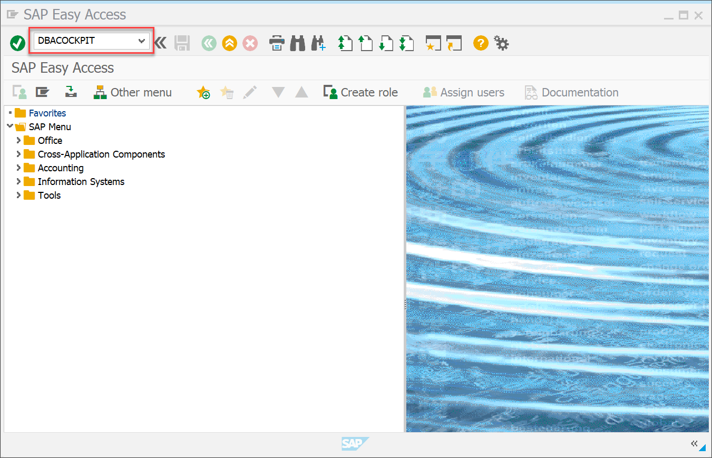

3. Navigate to the **Database Connections**, open the **SAP ASE** tab, select the database **NPL** and click **Change User Credentials**. Dismiss the notification that might pop up.

      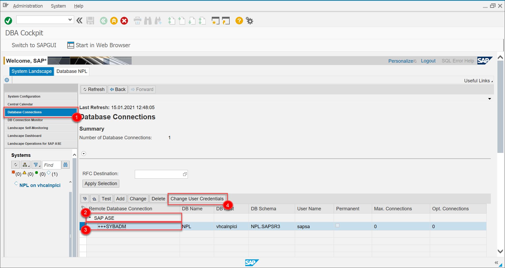

4. Enter your **sapsa-password** that you just set up. Afterwards, click **Log On**.

     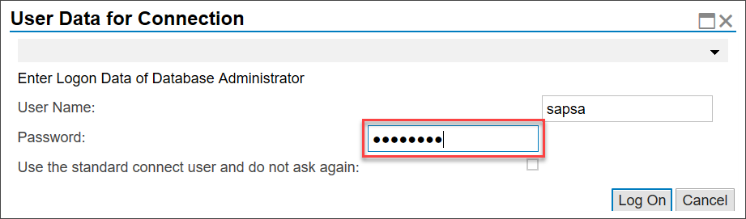

5. Test your connection to the database by clicking **Test**. Scroll down to see your Test Connection Protocol.

    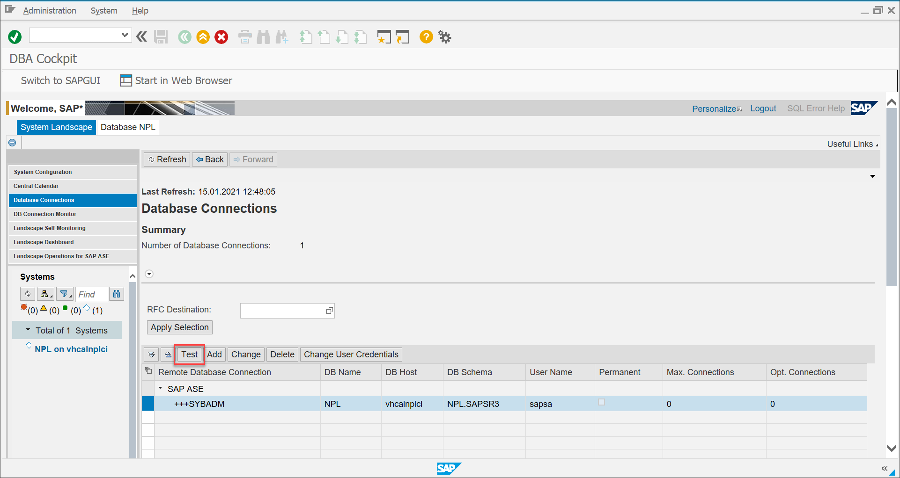

### Get to know: data collectors and admin Procedures

The screen Data Collectors and Admin Procedures provides an overview of the state of the installed history data collectors. You can use this screen to change the configuration of specific data collectors.

For more information on this topic, see [DBA Cockpit Framework: Data Collectors and Admin Procedures](https://help.sap.com/viewer/52f8de9cc8d44dc39ad7c49299dd9f1f/02/en-US/f3cd4e520b68d030e10000000a44538d.html).

1. Select **Database NPL**, then click on **Configuration** > **DBA Cockpit Framework** > **Data Collectors and Admin Procedures**.

    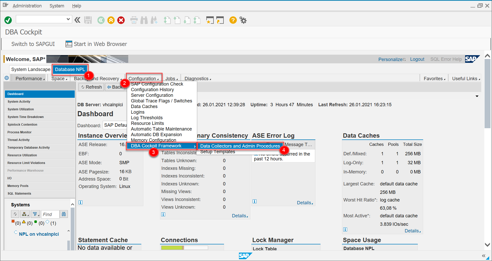

2. You can now see a list of data collectors and procedures. Click on one to see details.

    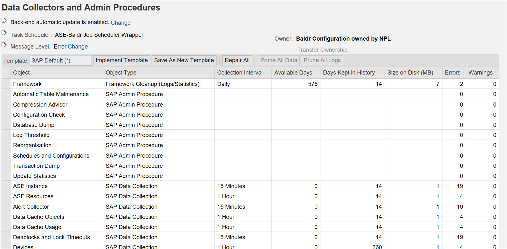

### Get to know: server configuration

Configuration parameters are user-definable settings that control various aspects of the behavior of the ASE server. The ASE server supplies default values for all configuration parameters. You can use configuration parameters to tailor the ASE server for an installation's particular needs. Configuration parameters are used for a wide range of services, from basic to specific server operations, and for performance tuning.

For more information on this topic, click [Configuration: Server Configuration](https://help.sap.com/viewer/52f8de9cc8d44dc39ad7c49299dd9f1f/02/en-US/d8a94e52c6a4d130e10000000a44538d.html).

1. Select **Database NPL**, then click on **Configuration** > **Server Configuration**.

    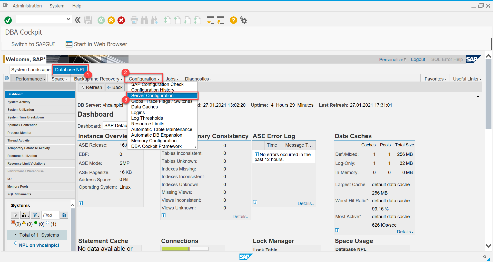

2. Make all parameters visible by unticking **Non-Defaults Only** followed by **Apply Selection**.

    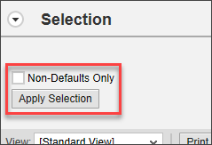

3. **Select** a parameter that you wish to change and click on **Change**. Make sure the selected parameter's Type is dynamic.

    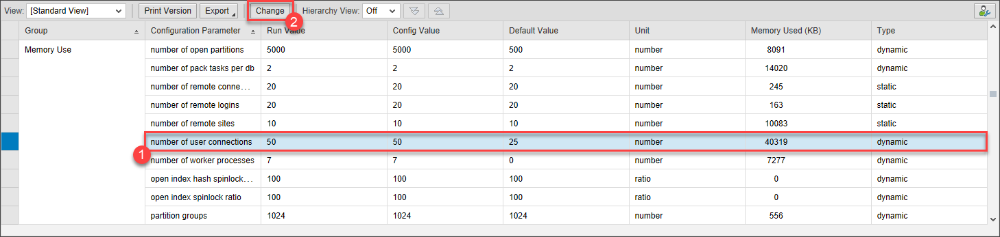

4. **Enter** a new parameter value. Click **Check**. If you don't see any error messages at the top, click **Execute**.

    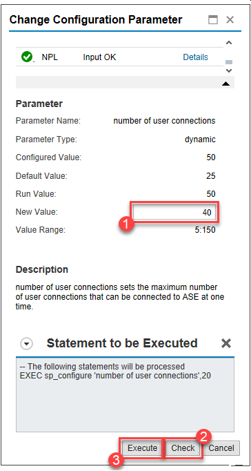

### Get to know: DBA Cockpit audit log

You can track changes to the database made from the DBA Cockpit and to the monitoring setup using the maintenance actions provided in the DBA Cockpit. Changes made from outside – for example, using native database commands – are not displayed here.

For more information on this topic, click [Diagnostics: DBA Cockpit Audit Log](https://help.sap.com/viewer/52f8de9cc8d44dc39ad7c49299dd9f1f/02/en-US/6dd84e52c6a4d130e10000000a44538d.html).

1. Select **Database NPL**, then click on **Diagnostics** > **DBA Cockpit Audit Log**.

    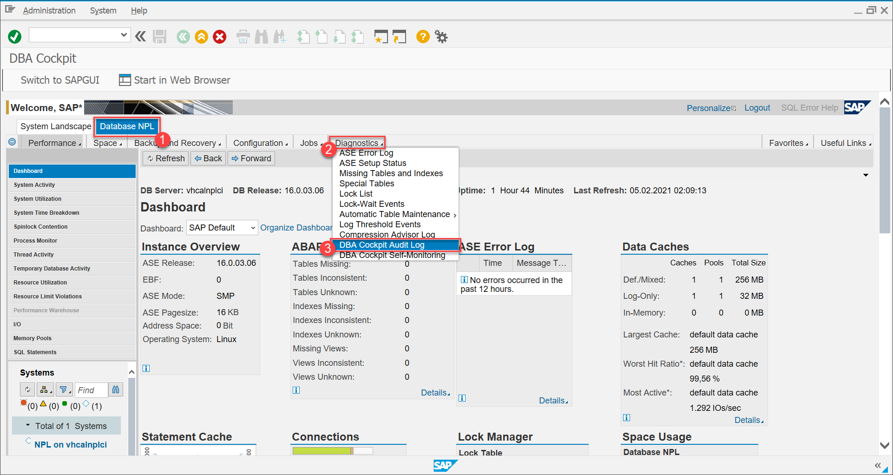

2. **Choose** a time window and click **Apply Selection**.

    

3. This leaves you with a list of actions and changes that were performed on the database

### Get to know: cached statements

This function provides monitoring capability for all prepared SQL statements that reside in the global SQL statement cache. The information about the cached statements is gathered during their preparation and execution.

For more information on this topic, click [Performance: Cached Statements](https://help.sap.com/viewer/52f8de9cc8d44dc39ad7c49299dd9f1f/02/en-US/ae3ceb54a93cef05e10000000a4450e5.html).

1. Select **Database NPL**, then click on **Performance** > **SQL Statements** > **Cached Statements**.

    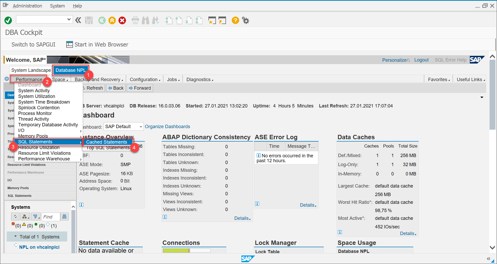

2. Here, you can see a list of the cached statements.

    **Select** one of them, scroll down to the Details and click on **Cached Query Plans**.

    **Select** one of the plans, if you see multiple ones. Afterwards, click **Show Plan**.

    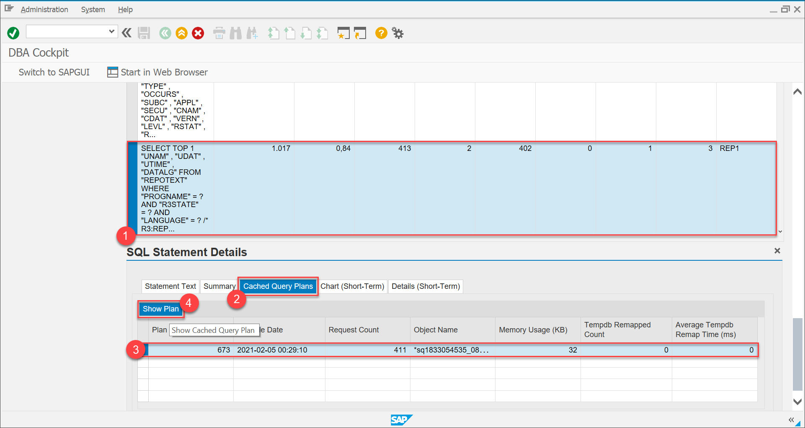

3. This renders the access plan for this query.

    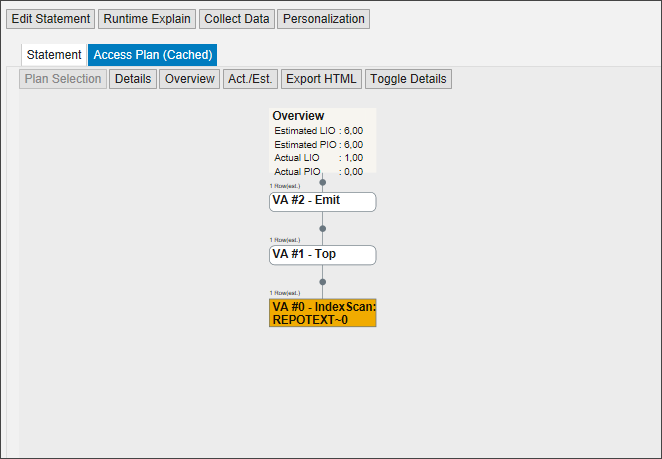

---
