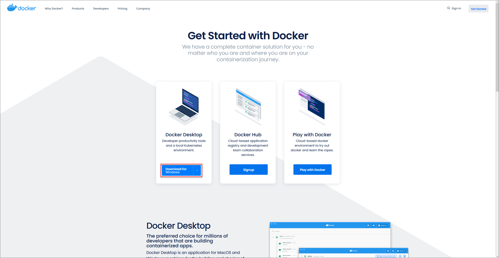
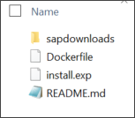
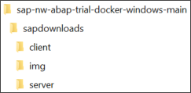
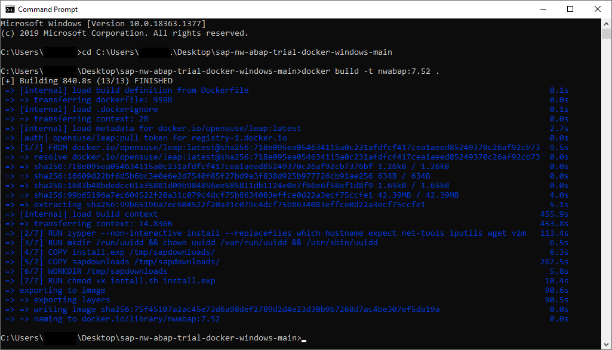
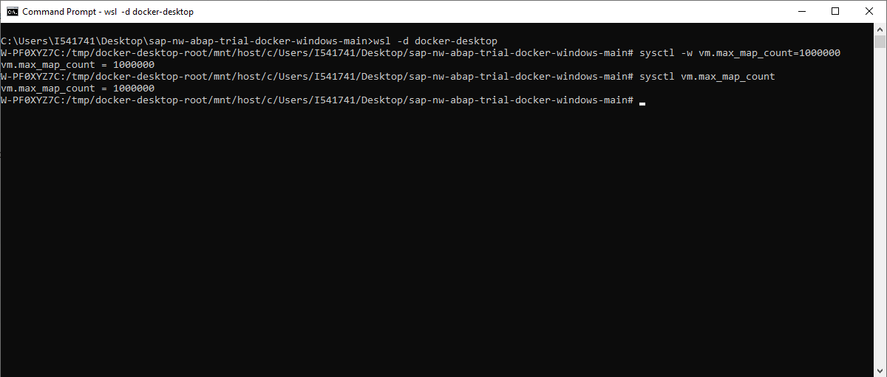
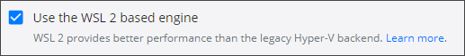
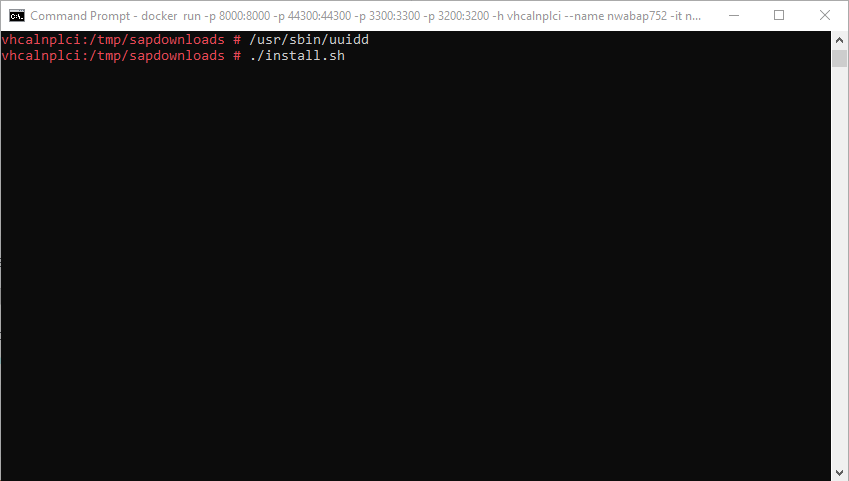
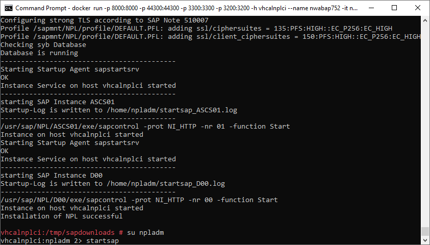

# Run Your SAP ASE 16.0 in Docker
<!-- description --> Have multiple systems at your fingertips with containerized SAP ASE installations.

## Prerequisites
 - You have already installed the SAP Logon Client.

## You will learn
  - How to run an SAP system in Docker


## Intro
This tutorial follows the guide found in [SAP NW ABAP Trial in Docker on Windows](https://github.com/brandoncaulfield/sap-nw-abap-trial-docker-windows).

---

### Download the required software


  1. **Download** and **install** [Docker Desktop](https://www.docker.com/get-started).

    

  2. **Download** [this GitHub repository](https://github.com/brandoncaulfield/sap-nw-abap-trial-docker-windows).

    When downloaded, **extract** the files to a convenient location.

    

  3. **Create** a folder named `sapdownloads` in the extracted folder.

    

  4. **Download** the [SAP NetWeaver ABAP Application Server](https://developers.sap.com/trials-downloads.html).

    >If you have installed the SAP system in a VM before, you already have downloaded these files.

    Scroll down to or search for (**Ctrl+F** search, not the search function) "SAP NetWeaver AS ABAP Developer Edition 7.52 SP04" and download all 11 parts.

  5. **Extract** these 11 files in the `sapdownloads` folder you created earlier. Your folder structure should look like this:

    


### Build and run the container


1. **Open** a new console and **navigate** to your local repository folder.

    **Run** the following command: `docker build -t nwabap:7.52 .`

    

2. **Change** the variable "`vm_max_count`" to 1000000 by entering following commands:

    `wsl -d docker-desktop`

    `sysctl -w vm.max_map_count=1000000`

    **Verify** the change by typing:

    `sysctl vm.max_map_count`

    

    Afterwards, exit the distribution by typing `exit`.

    >**Troubleshooting:** If the distribution "docker-desktop" cannot be found, make sure that **use the WSL 2 based engine** is ticked in **Settings > General**.

    

3. **Run** your docker container with following command:

    ```
    docker run -p 8000:8000 -p 44300:44300 -p 3300:3300 -p 3200:3200 -h vhcalnplci --name nwabap752 -it nwabap:7.52 /bin/bash
    ```


### Install the SAP system


1. **Run** the following commands to start the installation:

    `/usr/sbin/uuidd`

    `./install.sh`

    

2. **Read** the license agreement and type `yes` if you accept it.

3. **Enter** a password and **verify** your choice.

4. Wait for the installer to finish. This may take a while.


### Start the SAP system


1. **Switch** to user `npladm` and **run** the `startsap` command to start the SAP System.

    `su npladm`

    `startsap`

    


2. **Open** "SAP Logon" on your computer and create a new item with following properties:

    >Since the process of installing SAP Logon is covered in earlier tutorials, it will not be explained in detail here. Same applies for post-installation steps like licensing, which do not differ to those in earlier tutorials*

    


---
