# Install SAP NetWeaver AS on a Local Virtual Machine
<!-- description --> Install the SAP NetWeaver AS on SAP ASE 16.0 in a Linux VM on your local Microsoft Windows 10 system.

## Prerequisites
 - You have downloaded the required software, as described in [Get a Free SAP ASE 16.0](sapase-nwabap-preliminaries).

## You will learn
- How to install an SAP system in a VM on your local machine
- How to make this system available to a client running on the same local machine

## Intro
This is useful for educational purposes, if you want to expand or test your skills in the SAP environment without requiring an actual server running this environment.

<!--

1. VM 2min or less
2. openSUSE Setup 6+min

      SUSE Installation 28 min

3. (+4.5.) SUSE prep 13min + 53min unrar + 2min

6. 30 min ftp + 8min unrar

7. 30min ase install

 -->

This tutorial requires about 30 minutes of working time and about one hour of waiting time.

[This Blog](https://blogs.sap.com/2019/07/01/as-abap-752-sp04-developer-edition-to-download/) contains installation instructions for openSUSE on an Oracle VirtualBox as well as a VMware virtual machine.

---

### Set up a virtual machine instance

In this step, you will set up your virtual machine instance. This includes assigning resources and the operating system.

You can choose your Hypervisor (Oracle VirtualBox or VMware Workstation Player) by clicking on the desired one above.

---

[OPTION BEGIN [Oracle VirtualBox]]

1. Start Oracle VirtualBox and create a new VirtualBox instance by clicking **New**.

     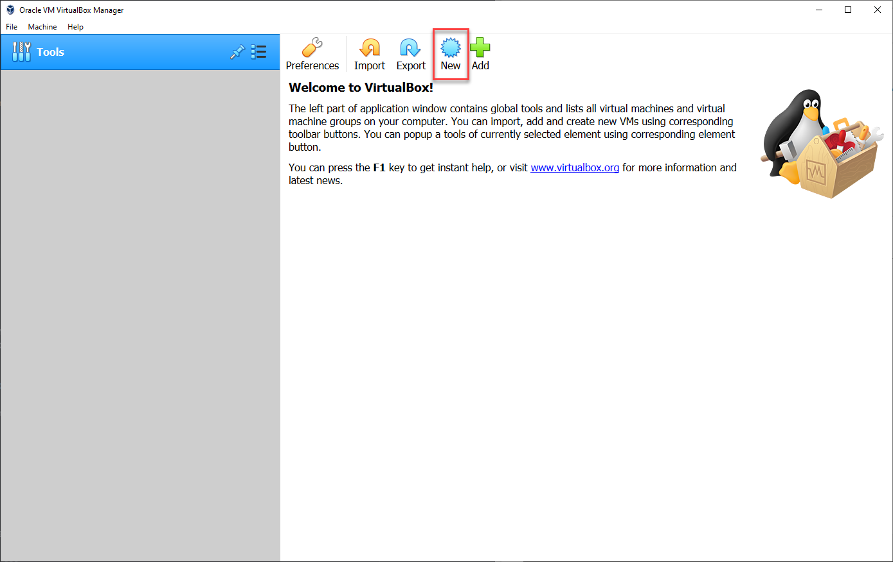

2. Change the highlighted values and click **Create**.

    

    - Type: **Linux**
    - Version: **openSUSE (64-bit)**
    - Memory size: **8192 MB** (can also be lowered to 6 GB if your physical memory cannot provide more. Lower than 6 GB has not been tested)
    - Hard Disk: **Create a virtual hard disk now**

3. In the appearing dialog, enter the following values and click **Create**.

    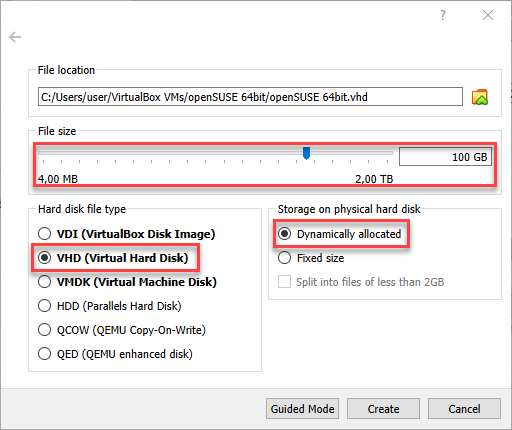

    - File Size: **100 GB**
    - Hard disk file type: **VHD (Virtual Hard Disk)**
    - Storage on physical hard disk: **Dynamically allocated**

4. You should now see the created VM instance.

    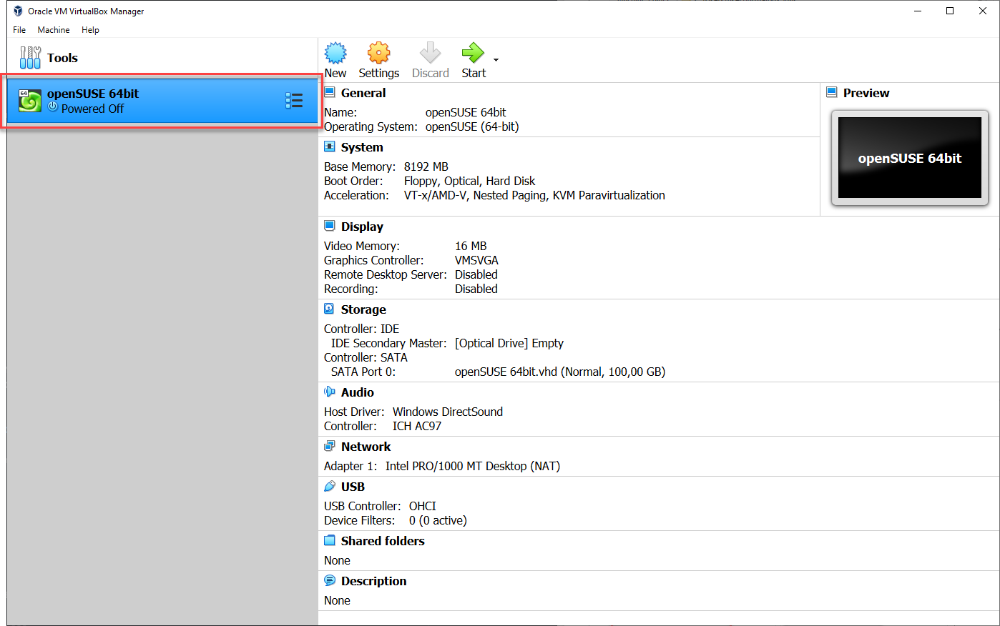

5. Under **Settings** > **Network**, enable a second adapter. Set this adapter to **Host-only Adapter**. Apply changes by clicking **OK**.

    *Note: Adapter 1 (attached to NAT) is responsible for online access, adapter 2 allows direct communication from guest OS (Linux) to host OS (Windows)*.

    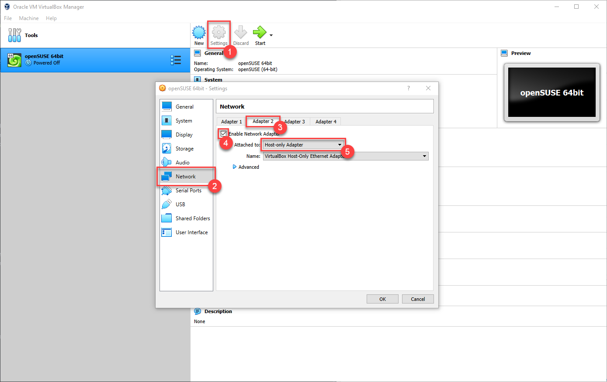

6. Select the new VM instance created in Step 1 and click **Start**.    

      

7. In the appearing window, click the folder icon to show the available disks that contain operating systems.

      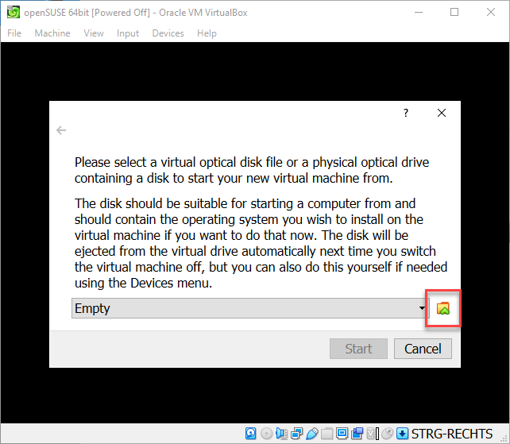

8. Add your openSUSE installation files (`.iso`) to this list by clicking **Add** and navigating to the previously downloaded files. Select the newly added file and click **Choose** and then **Start**.

      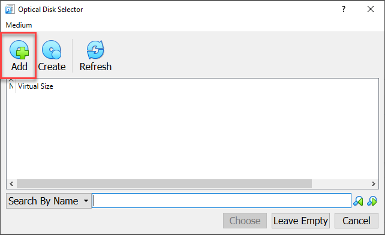

[OPTION END]

[OPTION BEGIN [VMware Workstation Player]]

VMware Workstation Player **15.5.5** and lower versions can run into some compatibility problems (see [here](https://kb.vmware.com/s/article/2146361), for example). Running VMware Workstation Player **15.5.6** or newer versions is recommended, however, you need to run **Windows 10 20H1 build 19041.264** or newer. You can check your Windows version by running `winver`:

  * Press **Windows-Key + R**

  * Enter `winver` and press **Enter**

---

1. Start VMware Workstation Player and create a new virtual machine instance by clicking **Create a New Virtual Machine**.

     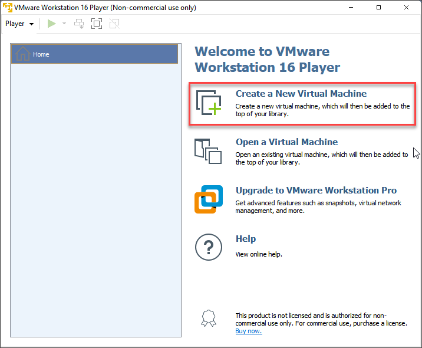

     ---

2. Select **install disc image file** and browse to your openSUSE `.iso` file that you downloaded previously. Afterwards, click **Next >**.

    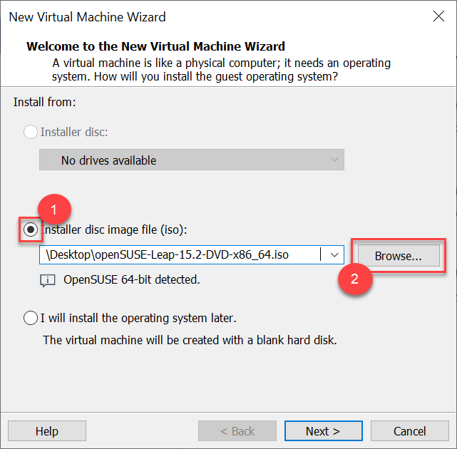

3. In the following window, choose a **name** for the virtual machine and select the **location** where it should be stored.

4. Increase the maximum disk size to **100GB** and click **Next >**.

    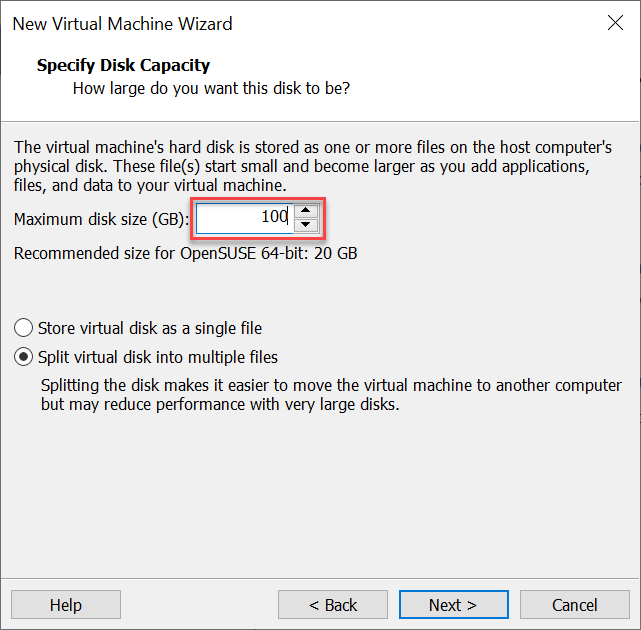

5. In the upcoming window, click **Customize Hardware...** and assign following values:

    - Memory > Memory for this virtual machine: **8192 MB** (can also be lowered to 6 GB if your physical memory cannot provide more. Lower than 6 GB has not been tested)
    - Processors > Number of processor cores: **2-4**, depending on your hardware

6. Click **Finish**. Your virtual machine should now start automatically.

[OPTION END]

### Install the guest operating system inside the VM

In this step, you will perform the installation of the guest operating system, openSUSE.

*Note: From now on, the procedure does not differ between Hypervisors anymore, except for the title that is shown in the VM window.*

4. When the VM instance was successfully set up and started, you should see this menu.

      Using your keyboard, select **Installation** in the upcoming menu, confirm by pressing **Enter**.

     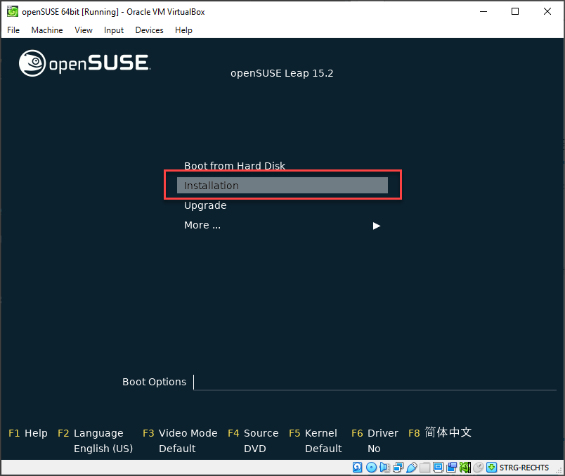

5. Set the keyboard layout to fit your keyboard and test the selected layout. Read the **License Agreement** and click **Next**.  

     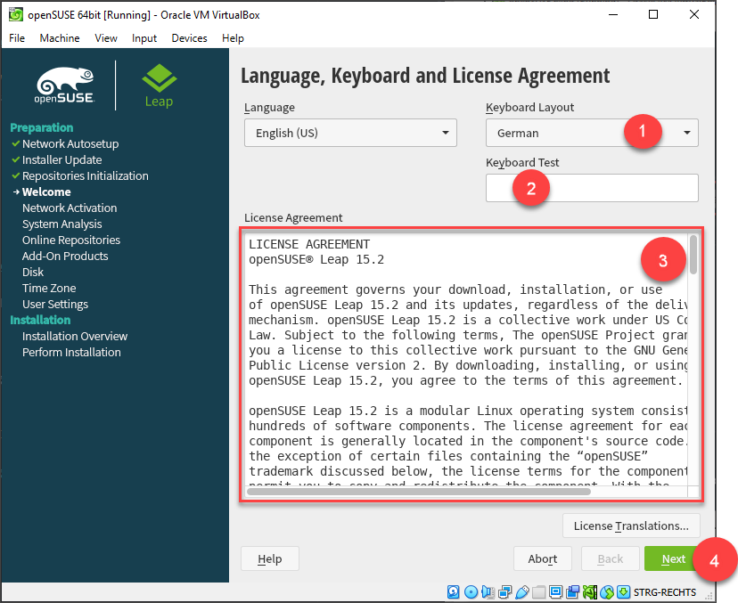

6. You may be prompted by YaST2 to activate online repositories at this point. You can click **No**, since this is not necessary for this tutorial.

7. Select **Desktop with GNOME** and click **Next**.  

     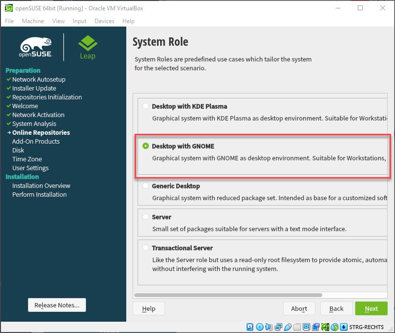

8. In Suggested Partitioning, click **Expert Partitioner** > **Start with Current Proposal**

9. Select your Main Partition (You can tell which one it is by checking the size), not your hard disk. Click **Modify** > **Edit Partition...**

     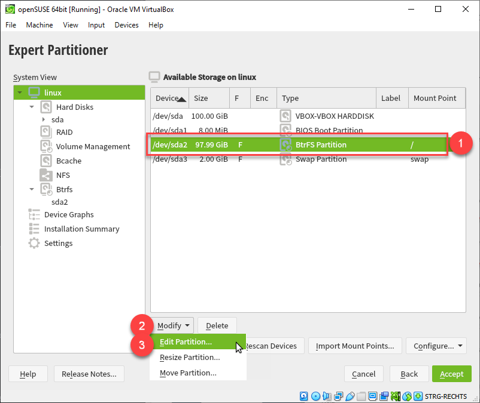

10. Select **Ext4** under filesystem and click **Next**.

     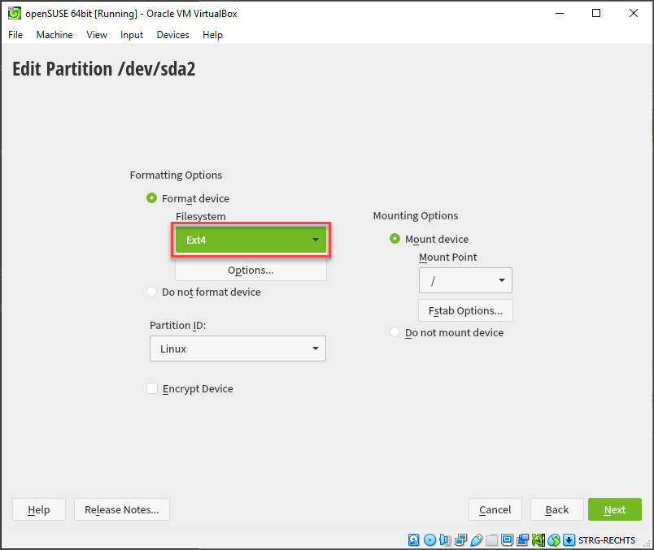

11. Accept the Partition Layout by clicking **Accept**. Back at the Suggested Partitioning window, click **Next**.

12. Select your Time Zone by **clicking on the map**. Afterwards, click **Next**.

     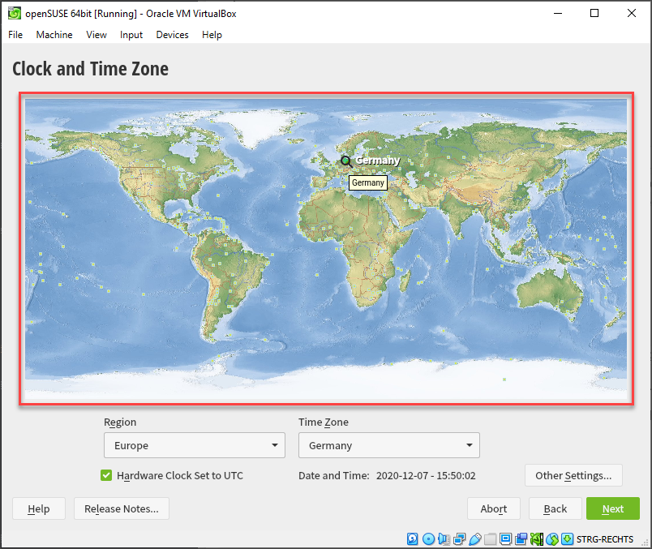

13. Create a user by filling the four fields, afterwards click **Next**.  

    **Do not click Install in the following window yet**

     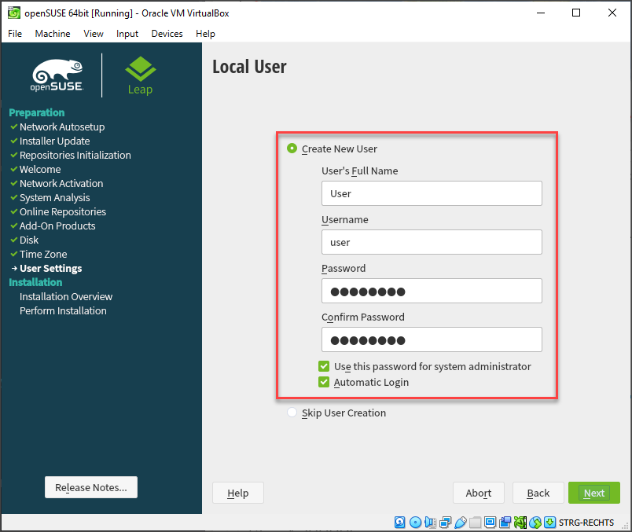

14. Scroll down to Security, **disable** Firewall and **enable** SSH Service. Afterwards click **Install** and confirm your choice by clicking **Install** again.

     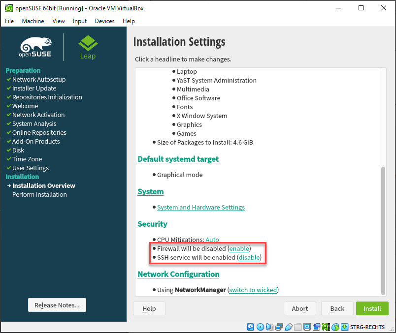

15. Wait for the installer to finish.

16. After the installation, the system will reboot and you will see something like this.  You can now select **Boot from Hard Disk** to boot your system.  

      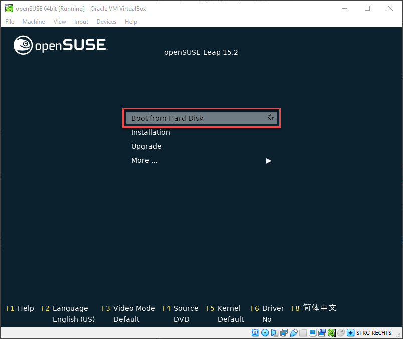

You now need to prepare the openSUSE system for the ABAP installation. This includes:

  - Install the Utility Package that can extract the ABAP `.rar` files
  - Install the `uuidd daemon`
  - Tweak the network settings
  - Assign root privileges to the install script

This will be done in the following three steps.

### Prepare the guest OS: storage and proxy

In this step, you will make sure that there is enough storage to install the ABAP application server. Additionally, a guide to set up a proxy connection is provided.

1. Boot your system. When prompted, select your openSUSE version or wait for the timer to run out.

2. When booted, you should see something like this. Click on **Activities**, search for and open `Terminal`.

    >The windows-key on your keyboard likely has the same effect as clicking on activities*

    >In the bottom right corner you can see the key that is defined as the host key. This is dependent on what you chose for your keyboard layout*

    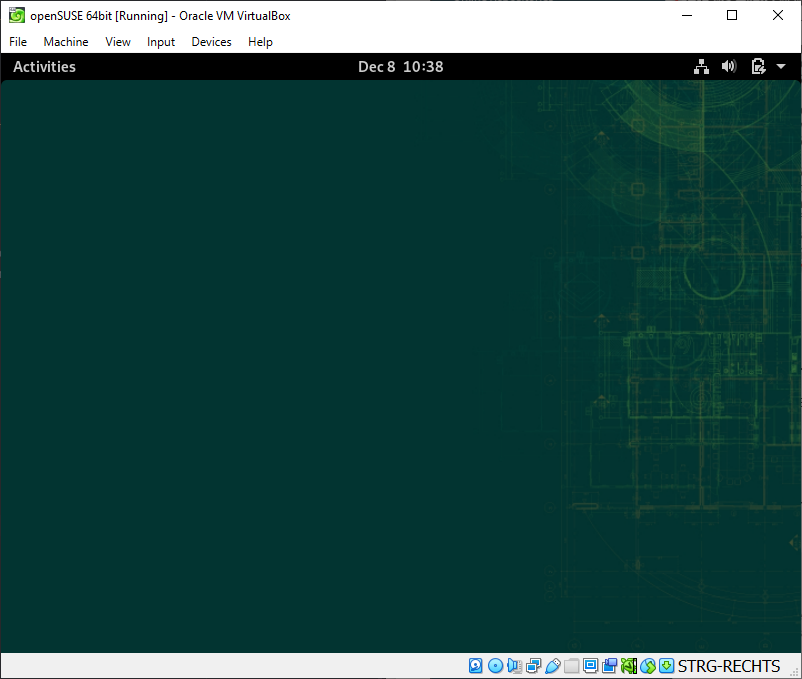

3. Check your used storage by typing `df -h` into the terminal. You should see something like this:

    `df` = disk filesystem, `-h` = human-readable*

    

    Make sure your free storage is around 90GB, to avoid errors during installation.

4. If you are behind a proxy, refer to [Installing AS ABAP 752SP04on Linux: Oracle Virtual Box](https://www.sap.com/documents/2019/09/32638f18-687d-0010-87a3-c30de2ffd8ff.html) to change the proxy settings.

### Prepare the guest OS: network settings

In this step, you will tweak some network settings, primarily to prevent problems that may arise later during usage of the ABAP application server.

5. Search for and open `YaST Network`. Enter your password, dismiss the initial warning and change the network setup method to **Wicked Service**.

      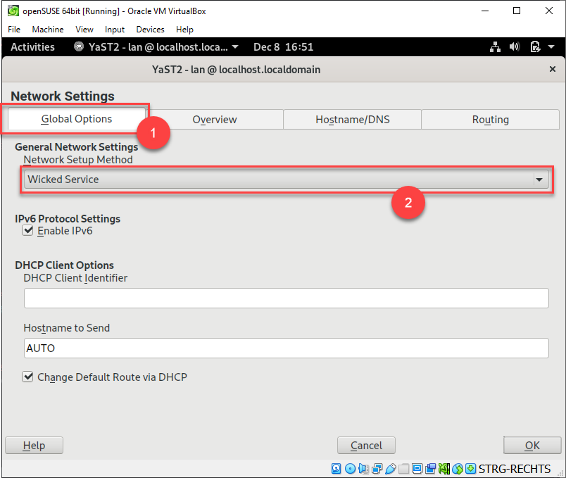

6. Change the hostname to `vhcalnplci` and set "Set Hostname via DHCP" to **no**.

      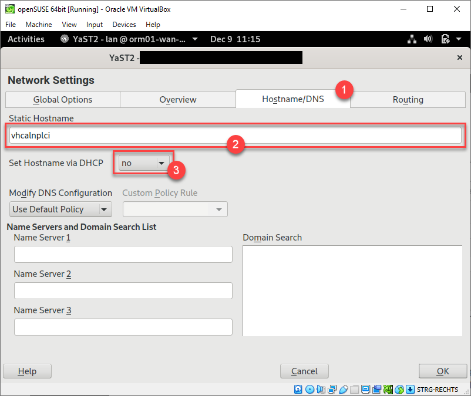

7. Edit the adapter that is responsible for communicating with the host.

    >For Oracle VirtualBox users, this is the Host-only adapter. Since this adapter was manually added, it should be the one with the higher device number (eth1 instead of eth0)*

    >For VMware Workstation Player users, there only is one network adapter.*

    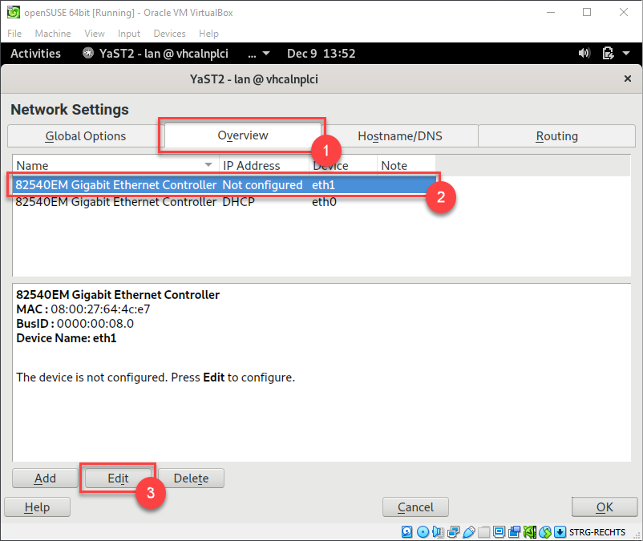

8. Set the address to **Dynamic Address**, click **Next** and apply all changes to the network settings by clicking **OK**.

      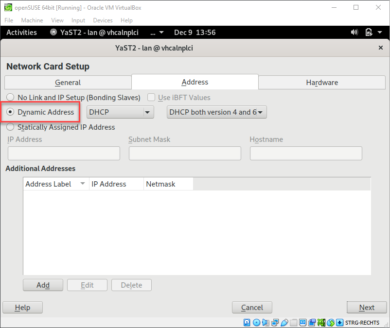

9. Find your current IP-address in the host network by typing `ip addr` in the terminal.

    >The IP-address likely has the form "192.168.nn.nnn"*

    >Consider noting down this IP-address, since you will need it quite often*

    >If you're using Oracle VirtualBox, the host network adapter is very likely eth1*

    >If you're using the VMware Workstation Player, you did no add a host-only adapter. Your should find the needed IP-address under "eth0"*

    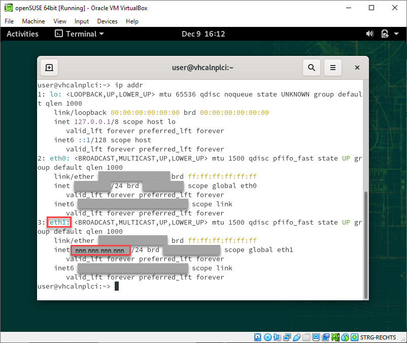

10. Link this IP-address to the new hostname by opening the `hostfile` by typing `sudo nano /etc/hosts` in the terminal. Add a new entry of the form:

    `<IP_Address>     vhcalnplci      vhcalnplci.dummy.nodomain`

    Press **Ctr + O** to save, confirm by pressing **Enter**. Close the file with **Ctr + X**.

    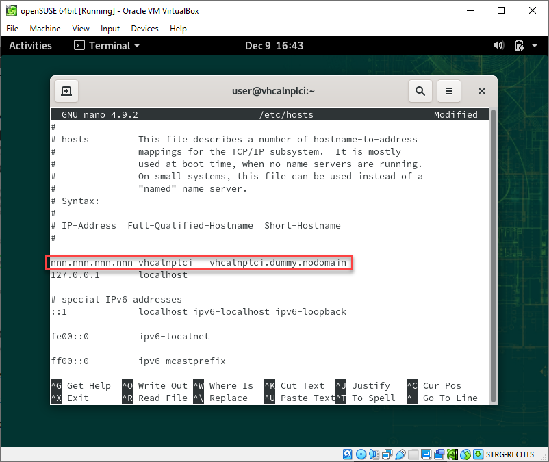

11. Verify the change by typing `sudo cat /etc/hosts`

### Prepare the guest OS: additional packages

In this step, you will install two packages:

- **`uuidd daemon`**. This daemon provides universal unique identifiers that are needed to generate database keys.
- Utility Package **`unrar`**, that will be used to unpack the ABAP .rar-files.

To perform the installation, the Linux System needs online access. The NAT-Adapter, that was created when the VM Instance itself was created, provides access to almost all network resources that are available to the host, as long as they support TCP/IP. That means that your Host OS needs to have online access.

9. Search for `YaST Online Update` and open it. Enter your password when prompted.

10. Search for `uuidd` and tick the box next to it. Confirm by clicking **Accept**. When prompted, accept automatic changes.

    

11. Following the same procedure, install the unpacking utility: open `YaST Online Update`, search for `unrar`, tick the box next to it and click **Accept**. Confirm messages regarding automatic changes and necessary system restarts.

    >Package "`unrar`" suffices, similar packages like "`unrar_wrapper`" do not have to be activated*

12. Wait for the system to finish the installation. Perform a restart after the system has finished.

13. Check if `uuidd` is installed. Open a new terminal and type `sudo service uuidd start`. Enter your password. Next, type `sudo service --status-all |grep uuidd` to check whether the service has started. Your console should look something like this:

      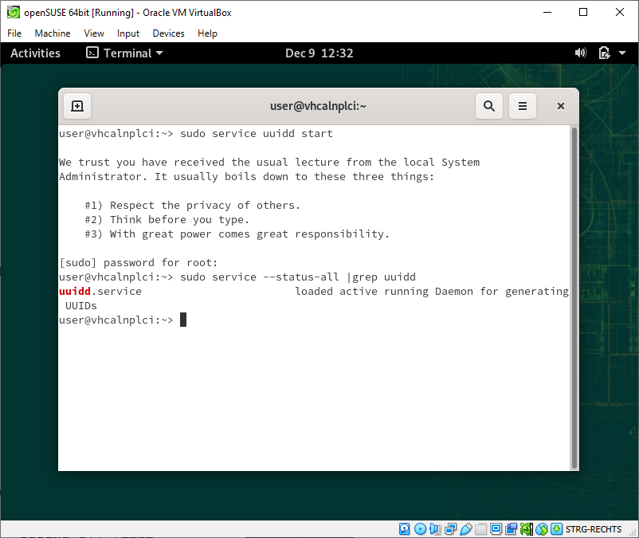

14. Make sure that `libaio` or `libaio1` is installed on your Linux system. In terminal, type `rpm -qa |grep libaio`. This should return your `libaio` library and version number, something along the lines of `libaio1-0.3.109-lp152.3.4.x86_64`.

### Prepare the host OS: port forwarding

In this step, you will make the ABAP server available to SAP GUI and other applications that expect to reach said server via "`vhcalnplci`"

1. Navigate to your Windows hosts file:

    `C:\Windows\System32\drivers\etc\hosts`

2. Open this file in administrator mode and add the following lines:

    `#DL 752 SP02`  (This is just a comment, for overview)

    `nnn.nnn.nnn.nnn vhcalnplci vhcalnplci.dummy.nodomain`

    >With `nnn.nnn.nnn.nnn` being the IP address you got from the `ip addr` command.

### Install the ABAP Server

In this step, you will

 - Copy the ABAP `.rar` files to your Linux system and unpack them there.
 - Go through the installation procedure.

>There are many ways to copy files from host to guest OS, like shared folders, drag & drop or copy and paste, if the hypervisor supports it. For this tutorial, WinSCP has been chosen*

1. Open WinSCP. In the window that pops up, enter the IP-address that you previously found, your username and your password. Press **Login**.

      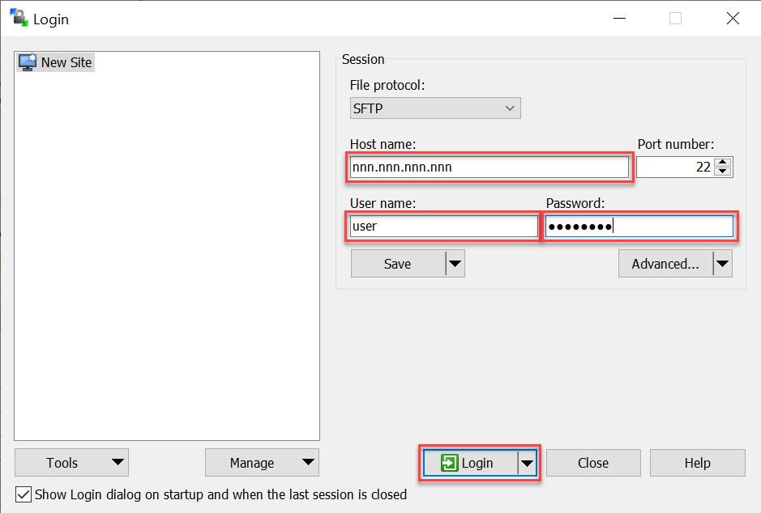

2. You are likely to see a warning at this point, because the server you want to reach is not yet known. Proceed by pressing **Yes**.

3. If you connect successfully, you will see two tabs. The left shows the file structure of your host machine, the right tab shows the file structure of your virtual machine.

    In the right tab, navigate to /home/\<username> and create a new folder named `abaptrial`. Within this folder, create another new folder named `ABAP`.

    In the left tab, navigate to the folder that contains the downloaded ABAP files.

    Copy the files to the ABAP folder via **Drag & Drop**.
    This may take a few minutes.

    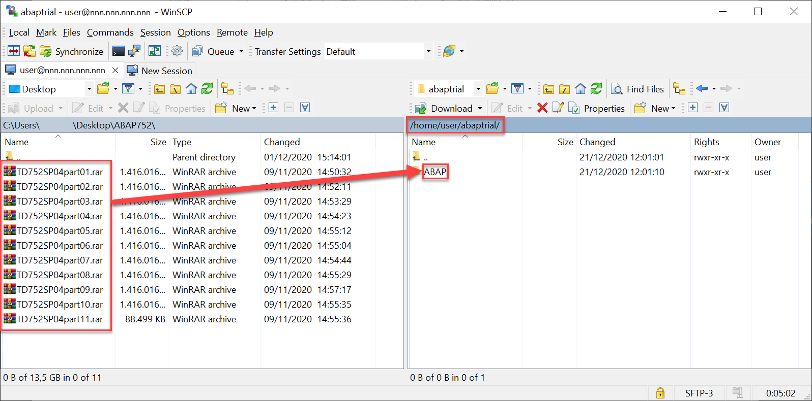

4. When WinSCP is done copying the files, head back to your Linux VM. You can verify that the files are in the correct location using the program "files".

    * If everything copied fine, open a new terminal and navigate to the ABAP folder:

        `cd /home/<username>/abaptrial/ABAP`

    * Unpack the files by typing:

        `sudo unrar x TD752SP04.part01.rar`

    >"x" =  "extract, retaining existing directory structure". Unrar then extracts all files automatically.*

    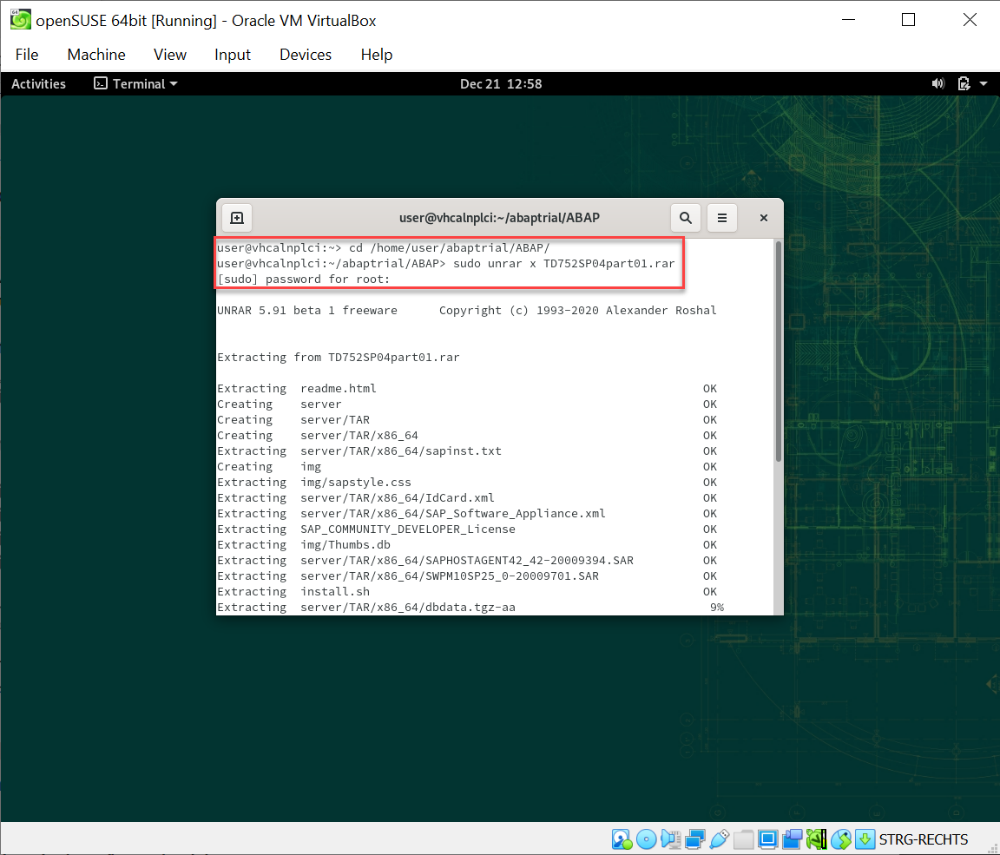

    The unpacking is completed if the terminal outputs "All OK". Now you can delete the .rar files to save space.

    >Only delete the .rar files on your Linux machine. You will need them on your Windows machine to install the SAP Logon Client later.

5. Now you will assign root privileges to the installer and start the installation of the SAP system.

    * First, grant yourself root privileges by typing:

        `sudo -i`

        and entering your password.

    * Then, navigate to your extracted folder by typing:

        `cd /home/<username>/abaptrial/ABAP`

    * Finally, assign the root privileges to the installer by typing:

        `chmod +x install.sh`

    * Now you can run the installation by typing

        `./install.sh`

    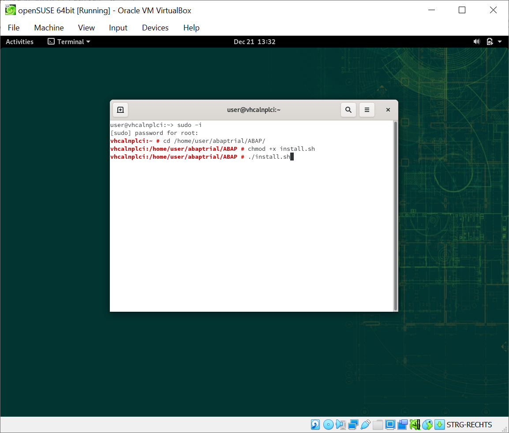

6. Start the installation by typing `./install.sh` in the terminal used by the previous step.

    * Read the License Agreement. After reading, close it with **q**.

    * Accept the agreement by entering `yes`.

    * Enter the password that you want to use, confirm the password by re-entering it.

        >**IMPORTANT:** Make sure to note down or to remember this password, since you will need it for future tutorials. This password will be referred to as your **_Master Password_**.

    * The SAP system will now be installed. This will take a while, be patient.

    * The installation is completed after following terminal outputs:

        **`Instance on host vhcalnplci started`**

        **`Installation of NPL successful`**

7. Your SAP system is now up and running. You can now connect to this system from your host operating system, using the SAP Logon Client.

    If you want to start or stop the system from now on, follow these steps:

    * Open a new terminal.

    * Switch user to `npladm`: `su npladm`

    * Enter your password.

    * Enter `startsap` to start or `stopsap` to stop the SAP system.

    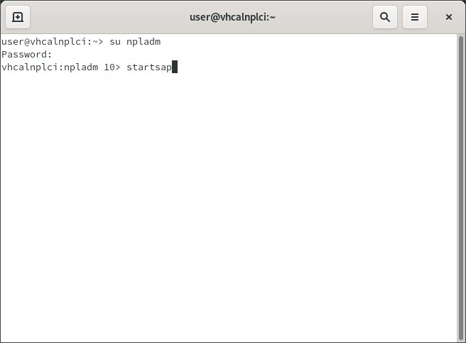

### Install the SAP Logon Client

In this step, you will install the SAP Logon client on your host operating system. This client will connect to the server running on your guest OS.

The client is included in the `.rar`-files that you downloaded earlier.

1. Navigate to the ABAP files stored on your host OS.

2. Navigate to:

    **`TD742SP04.part01.rar` > `SAPGUI4Windows` > `50144807_6.ZIP`**

    **`50144807_6.ZIP` > `BD_NW_7.0_Presentation_7.50_Comp._2_` > `PRES1` > `GUI` > `WINDOWS` > `Win32`**

3. Run `SetupAll.exe`.

    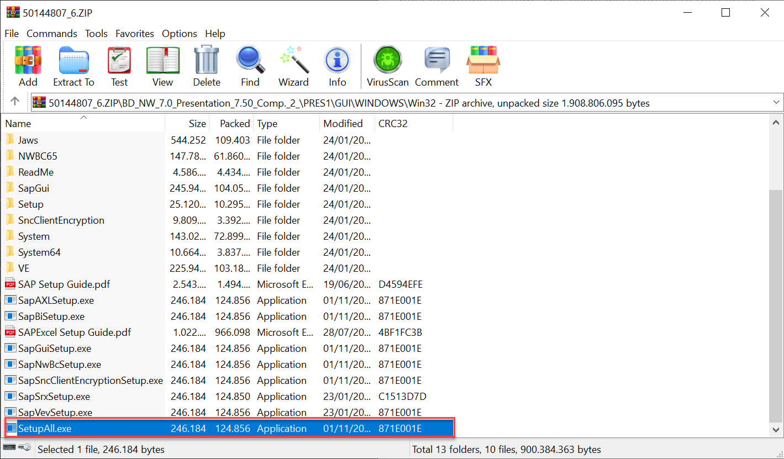

4. Navigate through the installation procedure until you arrive at the list of installable modules. Feel free to install whatever you want. Only **SAP GUI** is necessary.

    

5. Continue navigating through the installation procedure and install your selected modules. After the installation you should be able to find "SAP Logon" via your Windows search bar.

### Connect to your ABAP server

In this step, you will finally connect from your host operating system to your SAP ABAP server in your virtual machine.

1. Search for **SAP Logon** in your Windows search bar and open it. When opened, click on **New Item**.

    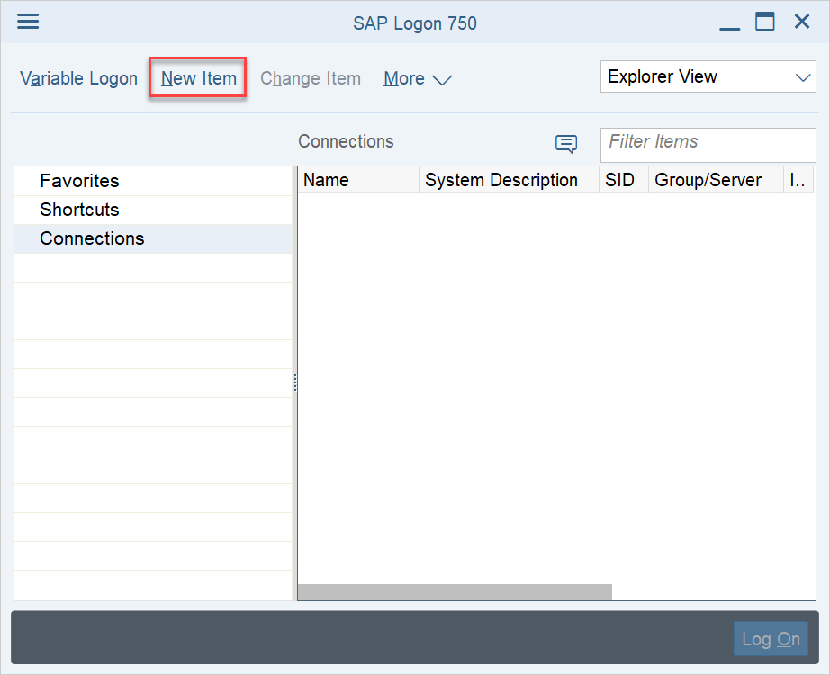

2. In the upcoming menu, select **User Specified System** and click **Next >**.

    

3. Enter the highlighted values and click **Finish**

    * Connection Type: **Custom Application Server**

    * Description: **NPL**

    * Application Server: **nnn.nnn.nnn.nnn**

        The IP-address you got earlier using the `ip addr` command.

    * Instance Number: **00**

    * System ID: **NPL**

    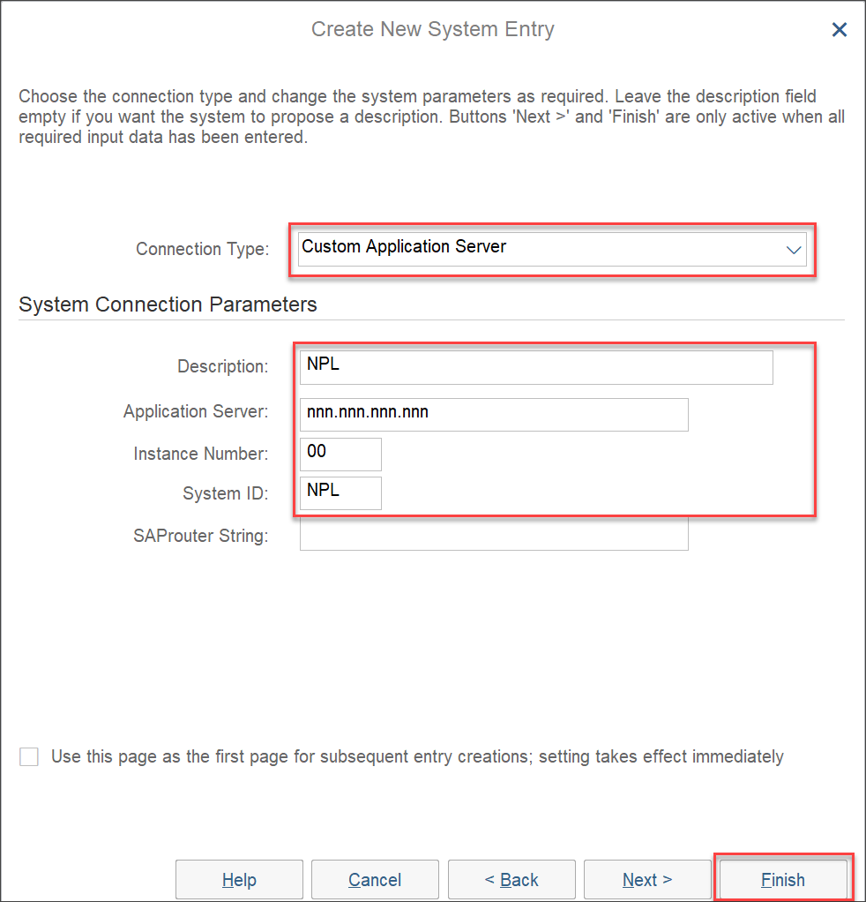

4. Log onto the server by double clicking the just created connection.

5. You should now see a login screen. Enter the following:

    * User: `SAP*`
    * Password: `Down1oad` (with number `1` instead of letter `l`)   and press **Enter**.

    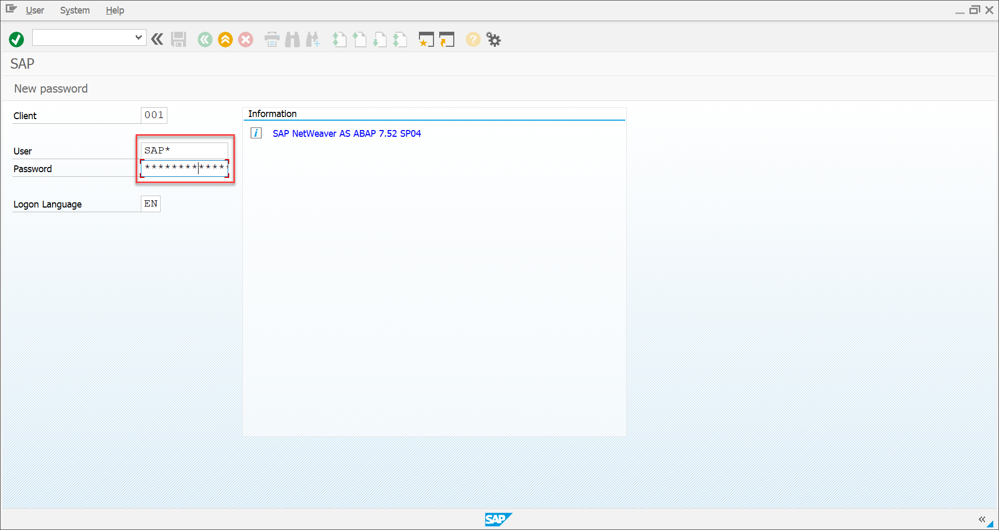

6. You should see a message pop up, informing you about the current license. You can discard the message.

7. If everything went smoothly you should now see the SAP Easy Access page.

    

### Post-installation steps

In this step, you will update the license under which the SAP System is running.

1. Open **SAP Logon** and connect to your SAP system as in the previous step. Use following credentials:

    * Client: **000**

    * User: **SAP\***

    * Password: **Down1oad**

2. Open the transaction `SLICENSE` by entering the transaction name in the command field and pressing **Enter**.

    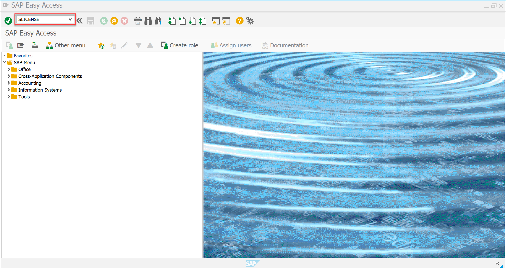

3. Note down or copy your hardware key. This key can be found in numerous locations:

    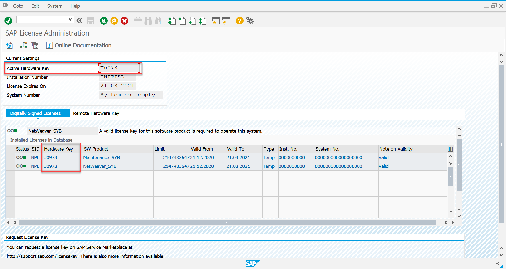

4. Get a license key at the [SAP License Keys for Preview, Evaluation and Developer Versions](https://go.support.sap.com/minisap/#/minisap) page.

    * Select **NPL - SAP NetWeaver 7.x (Sybase ASE)** from the list of systems

    * Enter your **Personal Data & System Info** (The hardware key you got earlier) below the list

    * **Read and accept** the License Agreement

    * Click **Generate** at the bottom right corner

    The website will then generate a text file. Download this file to a convenient location.

5. Delete all the existing licenses by **right clicking** on them and choosing **Delete License**.

6. Install the new license by **right click > Install License**. Navigate to your previously downloaded text file. Grant access to the file, if prompted.

---
