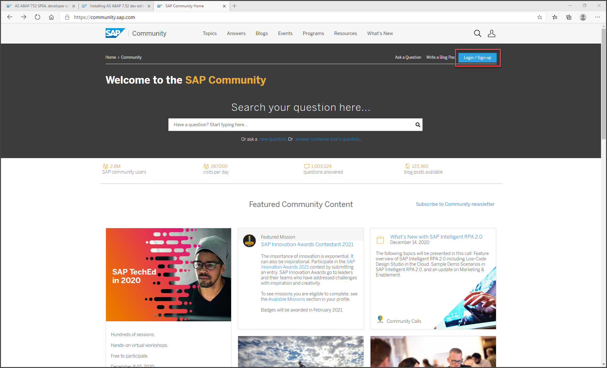
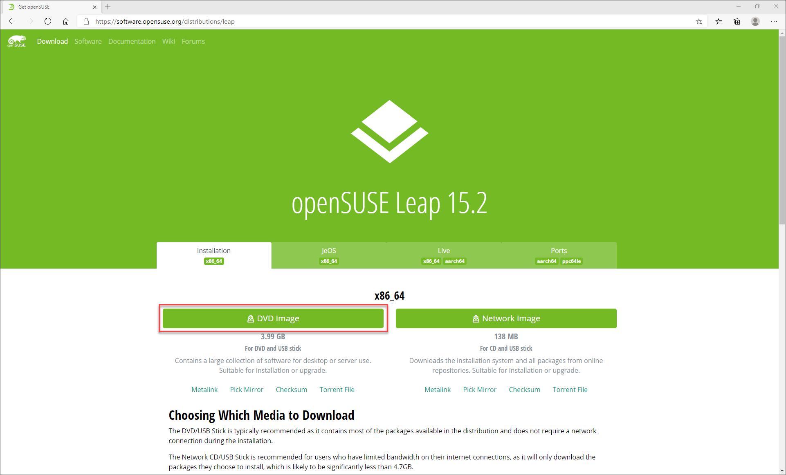

# Get a Free SAP ASE 16.0
<!-- description --> Find and download the trial version of SAP NetWeaver on SAP ASE 16.0 and the necessary components to run it.

## You will learn
  - How to download them SAP NetWeaver on SAP ASE 16.0
  - How to get more information

## Intro
This tutorial gives you the necessary knowledge foundation for the follow-up tutorials. If you  think this foundation should be improved or expanded, the SAP Community is the place to start your query.

---

### Explore the SAP Community

Visit the [SAP Community](https://community.sap.com/) and create an SAP account. You will need this account for Step 3.

Feel free to explore the SAP Community at your own pace. For example, search for Blogs with the keywords: `SAP Adaptive Server Enterprise` or `SAP ASE`

### Find information on SAP ASE 16.0

Using the SAP Community, find information about the SAP NetWeaver AS on SAP ASE 16.0 Developer Edition.

Interesting Blogs are listed below:

 - [AS ABAP 7.52 Developer Edition](https://blogs.sap.com/2019/07/01/as-abap-752-sp04-developer-edition-to-download/)

 - [FAQs](https://blogs.sap.com/2018/10/16/sap-as-abap-7.5x-developer-editions-faqs/)

The ABAP application server on ASE 16.0 provides a great platform for trying out the ABAP language. It is extensively pre-configured with SAP Fiori launchpad, SAP Cloud Connector, SAP Java Virtual Machine, pre-configured backend/frontend connections, roles, and sample applications.

This solution is intended for two groups of developers:

 - Non-ABAP developers, who are interested in learning more about the ABAP language and development tools
 - ABAP developers, who are interested in learning about version 7.52

### Download the required software

Click on the preferred Hypervisor above.

---

 In this Tutorial, you will install the NetWeaver Application Server on ASE. This server will run on a Linux Virtual Machine that is running on your Windows machine.

---

You will need:

- The [SAP NetWeaver ABAP Application Server](https://developers.sap.com/trials-downloads.html). Scroll down to or search for (Ctrl+F search, not the search function) `SAP NetWeaver AS ABAP Developer Edition 7.52 SP04` and download all 11 parts.

[OPTION BEGIN [Oracle VirtualBox]]

- The Hypervisor. Download the latest version of [Oracle VirtualBox](https://www.virtualbox.org/wiki/Downloads) for your operating system.

[OPTION END]

[OPTION BEGIN [VMware Workstation Player]]

 - The Hypervisor. Download the latest version of [VMware Workstation Player](https://my.vmware.com/en/web/vmware/downloads/info/slug/desktop_end_user_computing/vmware_workstation_player/16_0) for your operating system.

[OPTION END]

- The Guest Operating System that will be running in the VM: [openSUSE Leap 15 64bit](https://software.opensuse.org/distributions/leap)

    

- [WinSCP](https://winscp.net/eng/download.php) or a similar FTP client to copy the ABAP installation Files from your Windows System to your Linux System.

---

