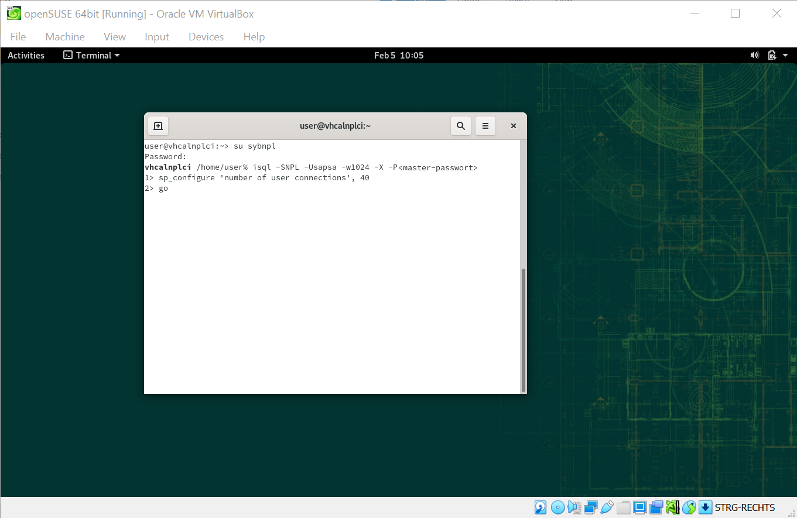

# Customize Your SAP ASE 16.0
<!-- description --> Downsize the enterprise version of SAP ASE 16.0 for your needs.

## Prerequisites
 - You have successfully set up the SAP Developer Trial System

## You will learn
  - How to manipulate database configuration parameters, to free up memory
  - This is helpful if you want to run the system on hardware with very limited resources.

---

### Connect to your database via isql

In this step, you will learn how you can connect to your database using `isql`. This will let you change server configuration parameters using a command-line interface.

  1. In your guest OS, open up a **new terminal**.

  2. **Switch to** user `sybnpl` by typing `su sybnpl`.

  3. **Enter** your password.

  4. type `isql -SNPL -Usapsa -w1024 -X -P<master-passwort>`

    This will connect you to the *NPL* database, using the account *`sapsa`* and the password *\<master-password\>*.

    `-w1024` and `-X` are optional formatting options.

    >\<master-password\> is the password you set during the installation of the ABAP server.

  5. To change, for example, configuration parameter **number of user connections** to 40, type `sp_configure 'number of user connections', 40`, followed by a `go` in the next line. Then, click **Enter**.

    

### Configure your SAP ASE 16.0

In this step, you are presented several configuration parameters that you can adjust in order to downsize the enterprise version of your database. Feel free to execute some or all of them, as shown in the previous step.

1. Set cache sizes.

    * **procedure cache size**

        `Sp_configure 'procedure cache size', 40960`

    * **log caches**

        `Sp_cacheconfig 'log cache', '16M'`

    * **session tempdb log cache size**

        `Sp_configure 'session tempdb log cache size', 16384`

    * **statement cache size**

        `Sp_configure 'statement cache size', 35840`

2. Set the **number of user connections** to 40.

    *Note: If you haven't already done this in step 1*

    `sp_configure 'number of user connections', 40`

3. Allocate max shared memory.

    By disabling this parameter, SAP ASE will allocate less memory during startup.

    `sp_configure 'allocate max shared memory', 0`

4. Set **network packet size** for adaptive users.

    `sp_configure 'default network packet size', 4096`

    `sp_configure 'max network packet5 size', 4096`

5. Set the **number of error log messages** SAP ASE stores per engine to 250 messages.

    `sp_configure 'errorlog pipe max messages', 250`

6. Set the **maximum nesting level** for stored procedures and triggers to 16.

    `sp_configure 'max nesting level', 16`

7. Set the number of  **network listeners** allowed by SAP ASE at one time to 2 users.

    `sp_configure 'max number network listeners', 2`

8. The parameters that control the total of **indexes, objects and partition** that can be open simultaneously are managed by metadata. The metadata caches resides in the server structures portion of Adaptive Server memory. The space for each of these caches is set using below parameters.

    `sp_configure 'number of open indexes', 5000`

    `sp_configure 'number of open objects', 5000`

    `sp_configure 'number of open partitions', 5000`

9. Set **heap memory per user**.

    `sp_configure 'heap memory per user', 52000`

10.	Set **number of alarm structures** allocated by adaptive server.

    `sp_configure 'number of alarms', 250`

11.	**Number of i/o buffers**

    Set the number of allocation unit-sized buffers reserved for performing large i/o for certain SAP ASE utilities.

    `sp_configure 'number of large i/o buffers', 12`

12.	**Max SQL text monitored**

    Set the amount of memory allocated per user connection for saving SQL text to memory shared by adaptive server monitor.

    `sp_configure 'max SQL text monitored', 8192`

13.	**Additional network memory**

    Set the maximum size of additional memory that can be used for network packets that are larger than default packet size.

    `sp_configure 'additional network memory', 8192`

14.	Set **stack guard size**.

    `sp_configure 'stack guard size', 8192`

15.	**Number of worker process, and Max utility parallel degree**

    Set maximum number of worker process that adaptive server can use at any time for all simultaneously running parallel quires, and max parallel degree specifies the server-wide maximum number of worker process allowed per query.

    `sp_configure 'number of worker processes', 7`

    `sp_configure 'max utility parallel degree', 7`

16.	For better performance set the **relaxed LRU replacement policy** for caches.

    `sp_cacheconfig 'default data cache', 'relaxed'`

    `sp_cacheconfig 'log cache', 'relaxed'`

17. SAP documents recommended to set the same value for both parameters **`max async i/os per server`** and **`disk i/o structures`**

    `sp_configure 'max async i/os per server',  4096`

    `sp_configure 'disk i/o structures', 4096`

18.	**Max memory**

    Set the amount of physical memory which is allocated for SAP ASE.

    `sp_configure 'max memory', 663040`

---
