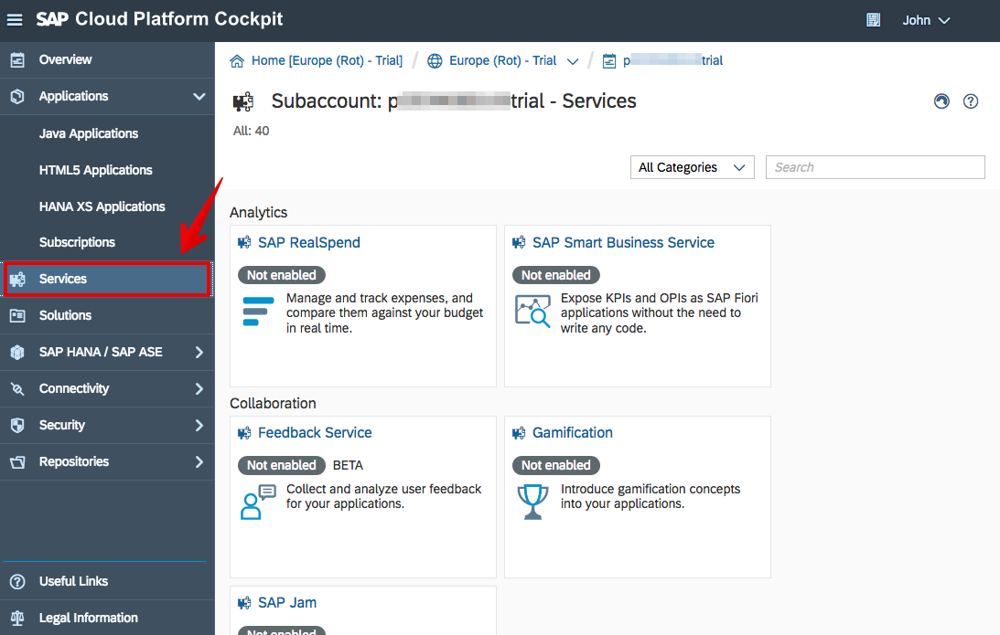
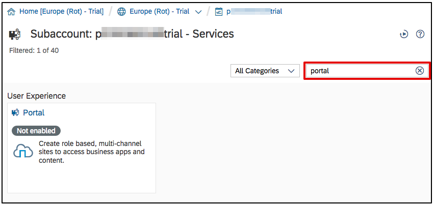
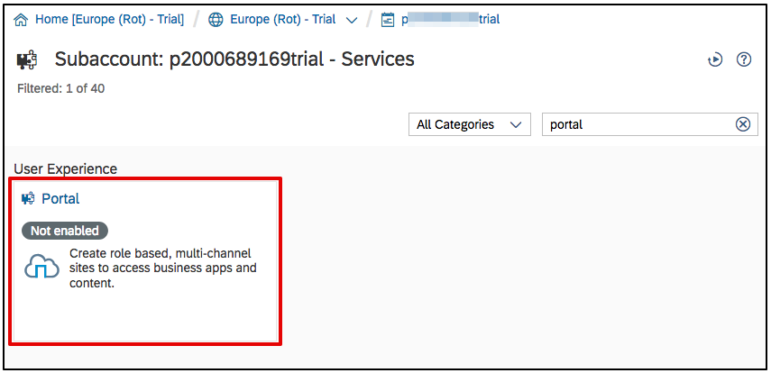
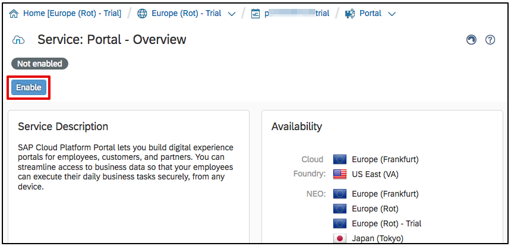
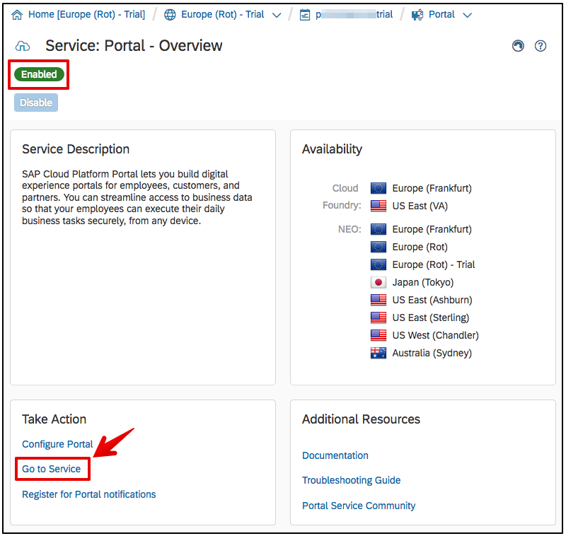
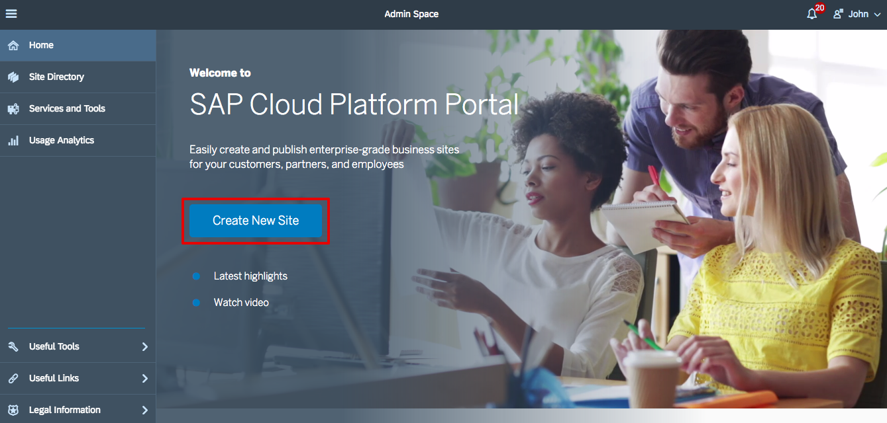
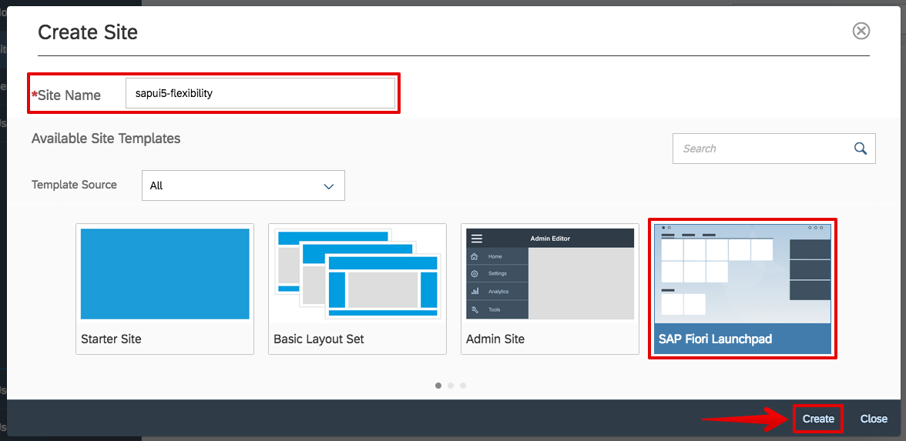
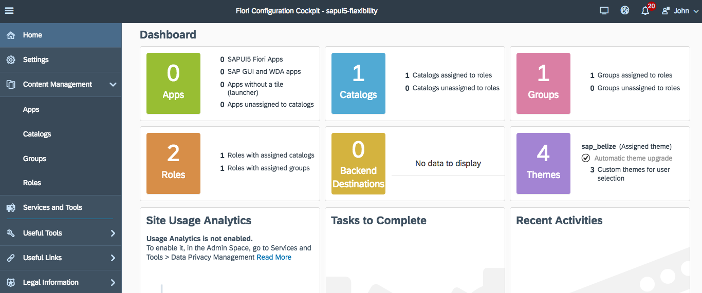

# Create your own SAP Fiori launchpad
<!-- description --> Using Portal, create your own Fiori launchpad to host your applications

## Prerequisites
 - **Proficiency:** Beginner

## You will learn  
  - How to enable your SAP Portal service
  - How to create your very own Fiori Launchpad

--

### Go to Services

Back in your SAP Cloud Platform cockpit, go to the **Services** page.

In the search menu, search for **Portal**.

### Open the Portal service

From the filtered down list of services, find the **Portal** service under the **User Experience** group.

**Click** on the tile for the Portal Service.

Make sure that the service is enabled, and if not click on **Enable**.

Once you see the green Enabled status, click on **Go to service** to launch the Fiori Launchpad Portal.

This will load the **Fiori Launchpad Portal**.

Copy the URL for your **Fiori Launchpad Portal**, and paste it in the text field below then click on **Validate**.

### Create a new site

On the Fiori Launchpad Portal, click on the **Create New Site** button.

### Set the site properties

Set the **Site Name** to **`sapui5-flexibility`**.

Select the **SAP Fiori Launchpad** as the **Template Source**.

Click **Create**.

### Fiori Configuration dashboard

Your Fiori Launchpad Configuration Cockpit will load.

Now your launchpad can be used with Web IDE to host apps that are deployed to the SAP Cloud Platform and registered in Fiori Configuration Cockpit.

### Validate your Fiori Launchpad

In your **Fiori Launchpad Cockpit dashboard**, copy the **URL up to the ?** and paste it in the below box.

