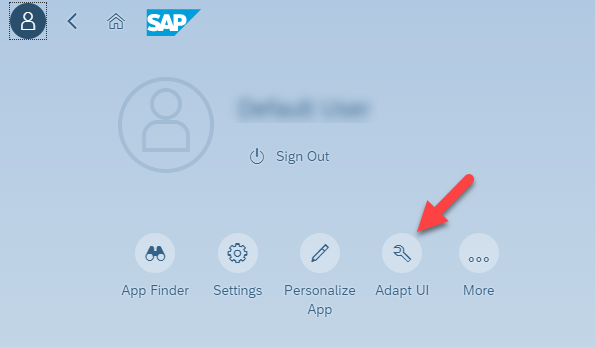
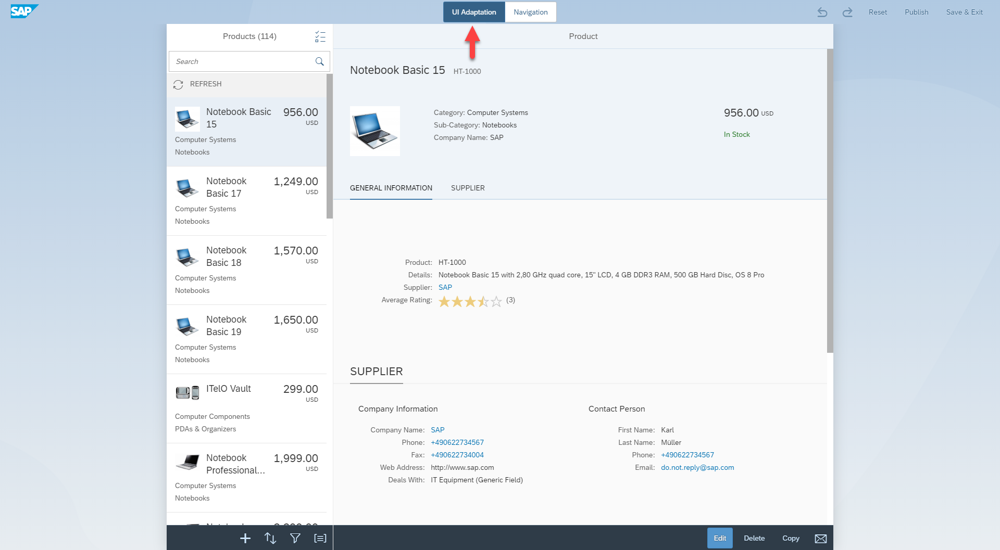
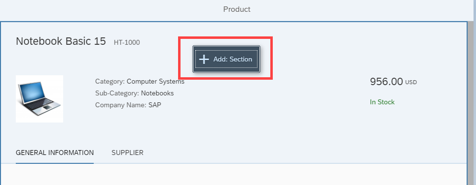
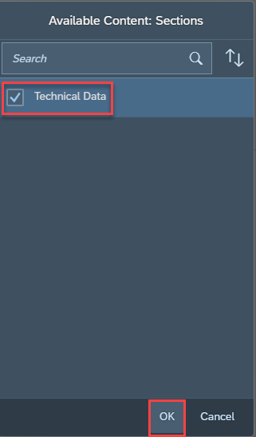
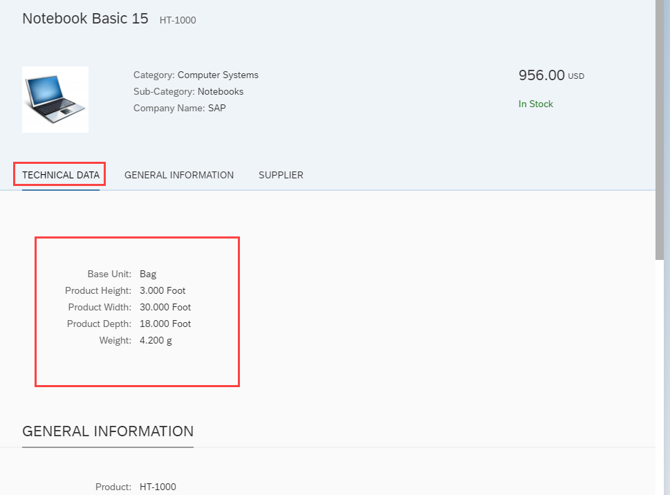
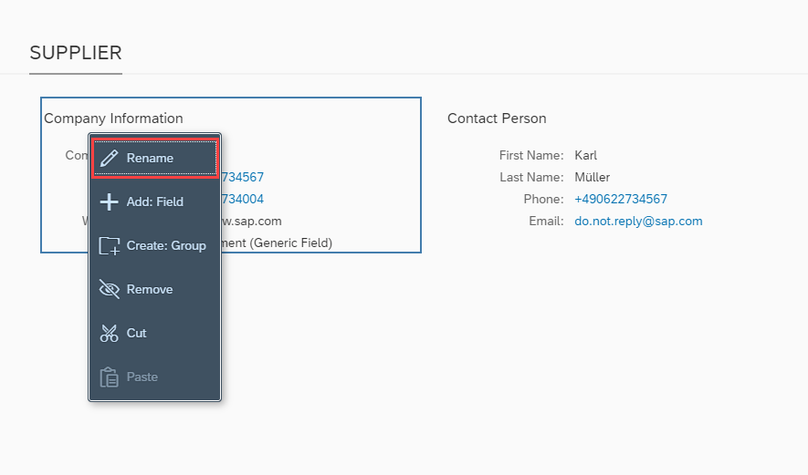
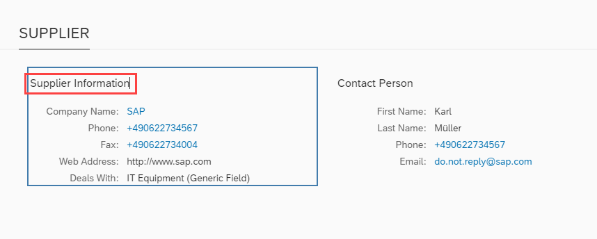

# Adapt Apps with Key User Adaptation
<!-- description --> Adapt the user interface of an app for other users with the key user adaptation feature of SAPUI5 flexibility.

## Prerequisites
 - You need the key user role to adapt the UI of an app. If in doubt, ask your administrator.

## You will learn
  - How to change the UI of an SAP Fiori app
  - How to make your UI changes available to other users

## Intro
With key user adaptation, you can change the user interface of SAP Fiori apps directly in the SAP Fiori launchpad intuitively and without having to write new code.

---

### Open UI adaptation mode

1. Open the app that you want to adapt.

> If you only want to Want to play around with a demo app and check out how key user adaptation works, go to the [SAPUI5 Demo Kit](https://ui5.sap.com/#/demoapps), and open the **UI Adaptation at Runtime** demo app.

2. Go to the **Me Area** of your app.

3. Choose **Adapt UI**

Congratulations, your app is now ready to be adapted.

>There's a lot you can adapt on the UI. Each of the following steps explains what you can do with certain controls or screen elements.

### Add a section

1. Right-click anywhere within a section until you can see the **Add: Section** option.

2. Choose **Add Section**.

3. Select an available section, and choose **OK** to add it to your UI.

4. Your selected section has been added to the UI.

### Rename a field

1. Right-click on a field.

2. Choose **Rename**

3. The field name is highlighted in blue. Overwrite the text.

4. Click anywhere outside the field to confirm your change.

### XXXXX

### XXXXX

### XXXXX

### XXXXX

### XXXXX

### XXXXX

### XXXXX

### XXXXX

### XXXXX

### XXXXX

### XXXXX

### XXXXX

### XXXXX

### XXXXX

### XXXXX

### XXXXX

### XXXXX

### XXXXX

### XXXXX

### XXXXX

### XXXXX

### XXXXX

---
