# Running the ESPM Twitter Integration sample app on SAP Cloud Platform
<!-- description --> Learn how to download, build, deploy, configure and run the ESPM Twitter Integration JAVA sample app on SAP Cloud Platform

## Prerequisites  
 - **Proficiency:** Intermediate
 - Basic knowledge about JAVA and OAuth authentication.
 - [Oracle Java SE Development Kit (JDK) 8](http://www.oracle.com/technetwork/java/javase/downloads/jdk8-downloads-2133151.html)
 - [Eclipse Neon](https://help.sap.com/viewer/65de2977205c403bbc107264b8eccf4b/Cloud/en-US/761374e5711e1014839a8273b0e91070.html)
 - [SAP Development Tools for Eclipse](https://help.sap.com/viewer/65de2977205c403bbc107264b8eccf4b/Cloud/en-US/76137a37711e1014839a8273b0e91070.html)
 - [SAP Cloud Platform Neo Environment SDK, Java Web Tomcat 8](https://tools.hana.ondemand.com/#cloud)
 - [Set Up the Runtime Environment in Eclipse, Java Web Tomcat 8 Runtime](https://help.sap.com/viewer/65de2977205c403bbc107264b8eccf4b/Cloud/en-US/7613f000711e1014839a8273b0e91070.html)
 - [Sign up for a free trial account on SAP Cloud Platform](https://developers.sap.com/tutorials/hcp-create-trial-account.html)


## You will learn  
This cool sample app will show you how to integrate Twitter to your Java app. It uses Twitter for OAuth authorization and show how to call a Twitter API to publish a tweet from your app.
## Time to Complete
**20 Min**

---

## Intro
In this app, customers log in using Twitter as OAuth authorizer. Using Twitter ID, they can shop and tweet about the products they bought.

These are the steps to download, build, deploy, configure and run our Twitter Integration app.

### Create ESPM Application in Twitter

1. Register ESPM Web Shop application in the developer or API portion of Twitter website (https://apps.twitter.com) by clicking on **Create New App**.
2. Enter the **Application Name** (for example: `Twitter_Integration`), **Description**, **Website** (for example: `https://www.sap.com`), **Callback URL** (for example: `https://www.sap.com`), then click on **Create your Twitter Application** button.
>**Note**: We need to set a sample callback URL to retrieve the Request Token and get the Access Token with `OAuth_verifier` parameter, which will be added to the actual callback URL in the application upon successful login.
3. Click on **Keys and Access Tokens** tab, then take note of **Consumer Key** and **Consumer Secret** key.

### Configuring Maven in Eclipse

1. in Eclipse, click on menu **Window** > **Preferences** if you are on Windows, or press Command + , if you are on Mac.
2. Navigate to **Maven** > **User Settings**.
3. Click on **Open file** under **User Settings**. If you do not have one, create the file `/Users/your-user-name/.m2/settings.xml`.

4. The contents of the `settings.xml` file should look like the snippet below.  

```xml
<settings xmlns="http://maven.apache.org/SETTINGS/1.0.0"
	xmlns:xsi="http://www.w3.org/2001/XMLSchema-instance"
	xsi:schemaLocation="http://maven.apache.org/SETTINGS/1.0.0 http://maven.apache.org/xsd/settings-1.0.0.xsd">
	<localRepository>${user.home}/.m2/repository</localRepository>
	<profiles>
		<profile>
			<id>development</id>
			<activation>
				<activeByDefault>true</activeByDefault>
			</activation>
			<properties>
			</properties>
		</profile>
	</profiles>
	<proxies>
		<proxy>
			<active>true</active>
			<protocol>http</protocol>
			<host>proxy</host>
			<port>8080</port>
		</proxy>
	</proxies>
</settings>  
```

>**Note**: For most people, the proxy value does not need to be set, so you can remove the entire proxy section from the snippet, but if you are working behind a proxy, then it should be set as per your environment.

### Configuring Git in Eclipse

1. in Eclipse, click on menu **Window** > **Preferences** if you are on Windows, or press Command + , if you are on Mac.
2. Navigate to **Team** > **Git** > **Configuration**.
3. Add the following configuration:
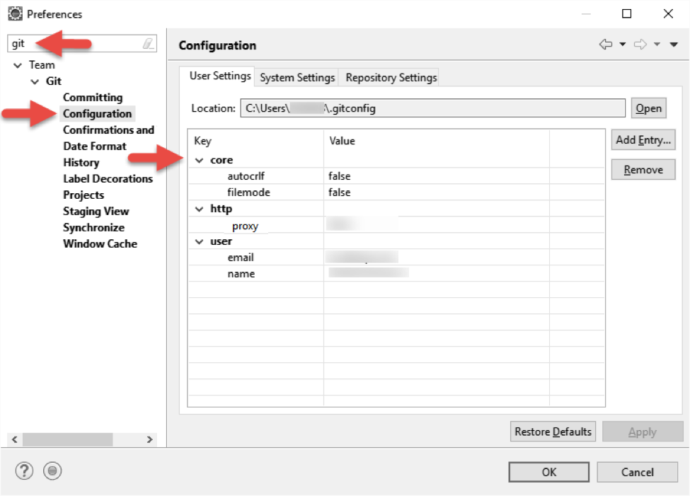
>**Note**: For most people the proxy value does not need to be set, but if you are working behind a proxy, then it should be set as per your environment.

### Cloning Git repository and importing Maven project

1. Open <https://github.com/SAP/cloud-espm-v2/tree/Twitter_Integration> with your web browser.
2. Click on **Clone or download**, then on Copy to clipboard icon.

3. In Eclipse, go to menu **Window** > **Perspective** > **Open Perspective** > **Other...**.
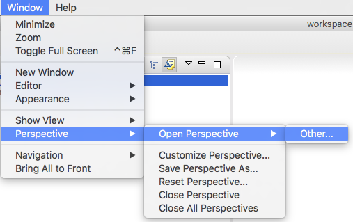
4. Select **Git** and press **OK**.
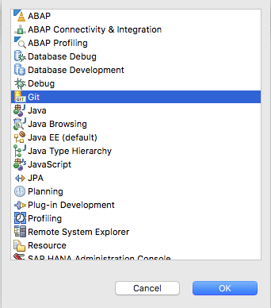
5. In **Git Repositories** box, you will see three links. Click on the **Clone a Git repository** link.
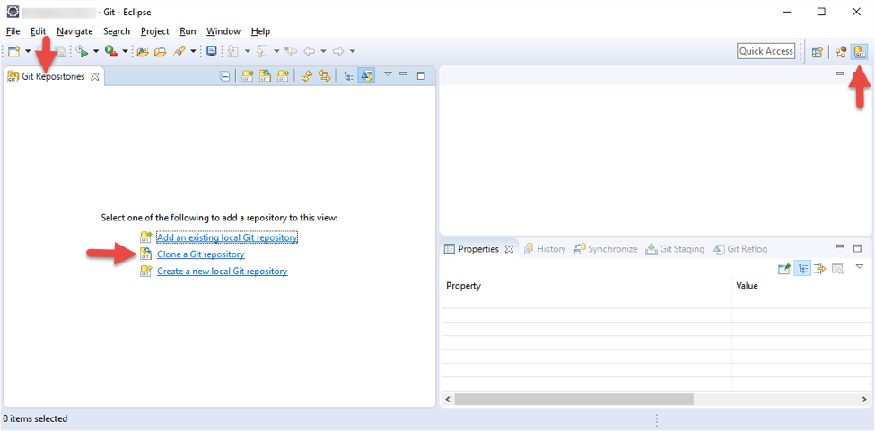
6. Because you copied before the project repository URL to your clipboard, the fields of the opened dialog are filled automatically with the correct values. So do not change anything, just click on **Next >**.
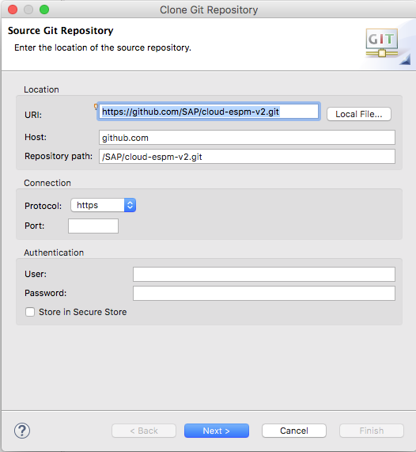
7. Select only the `Twitter_Integration` branch, then press **Next >**.
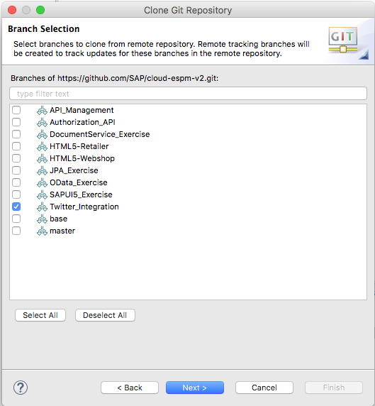
8. On the last wizard page you can adjust the location of the local Git Repository, but for the scope of this tutorial we will just leave the default as-is. Copy the path and click on **Finish**.
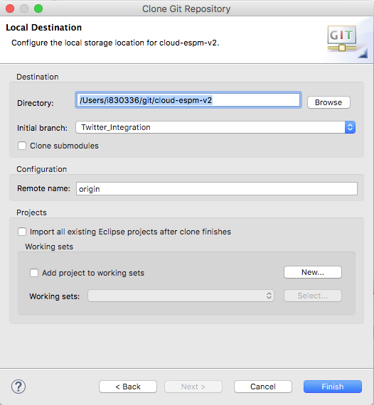
9. Go to menu **File** > **Import** > **Maven** > **Existing Maven Projects**.
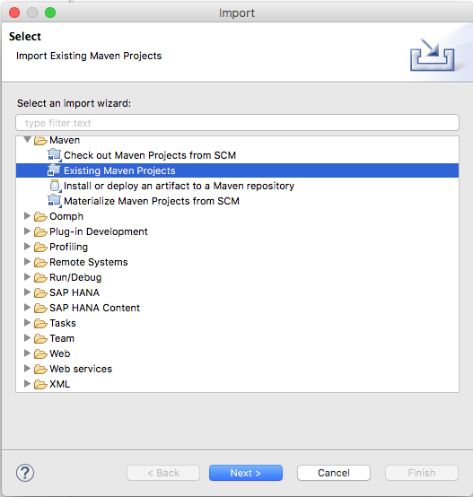
10. Paste the path of your downloaded project.
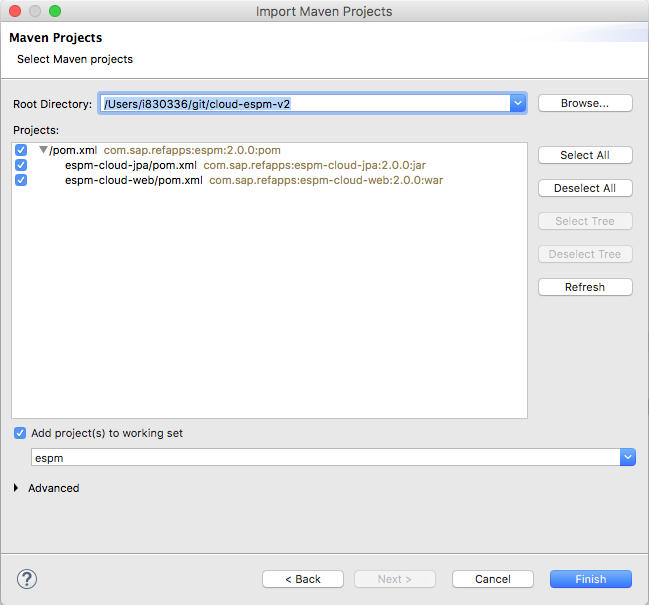
11. Click on **Finish**.

### Building the Maven project

1. In Eclipse, go to menu **Window** > **Perspective** > **Open Perspective** > **Other...**.

2. Select **Java EE** and press **OK**.

3. In the **Project Explorer** window, right click on `espm` project folder and choose **Maven** > **Update Project**.
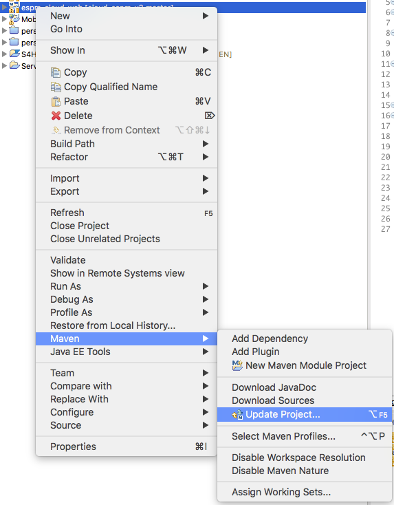
4. Press **OK** and wait until the update is finished.
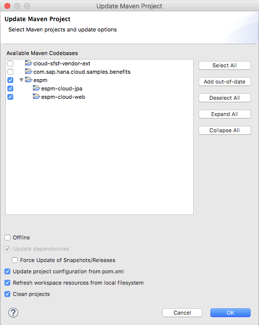
5. In the **Project Explorer** window, right click on `espm` project folder and choose **Run As** > **Maven build...**.
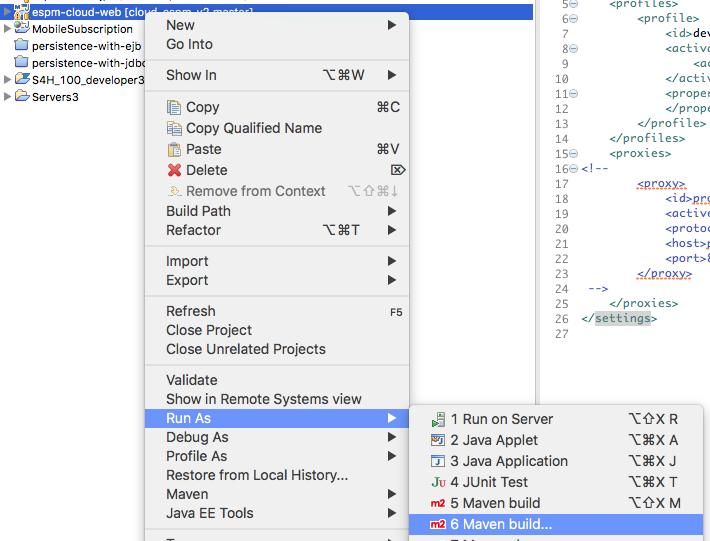
6. In the goals field, write `clean install`, then click on **Run**.
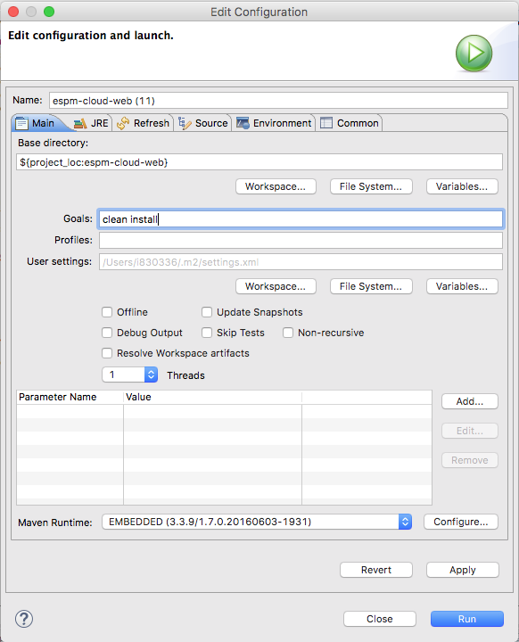
7. In the **console** window, you should have a **BUILD SUCCESS** info.
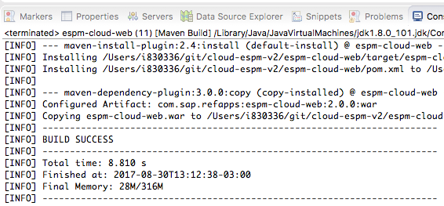
8. Update your project again like step 3.

### Deploying the application on SAP SCP via the cockpit

1. Log in to SCP on your trial account, then click on **Applications** > **Java Application** > **Deploy Application**.
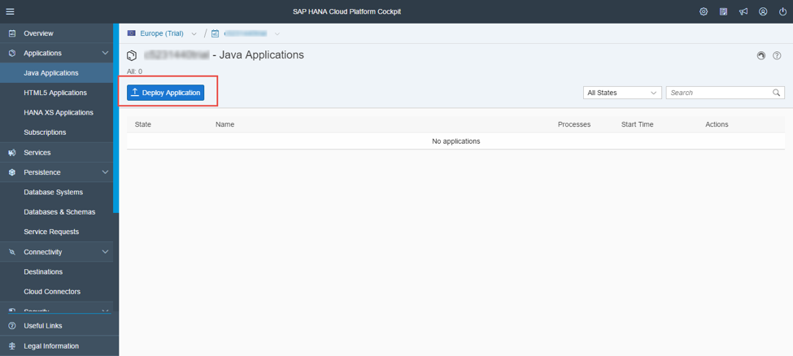
2. Set the fields as described below, then click on Deploy.

  Field Name         | Value
  ------------------ | ------------------
  War File Location  | `<Your_Project_Folder>/espm-cloud-web/target/espm-cloud-web.war`
  Application Name   | `espm`
  Runtime Name       | `Java Web Tomcat 8`
  JVM Version        | `JRE 8`
  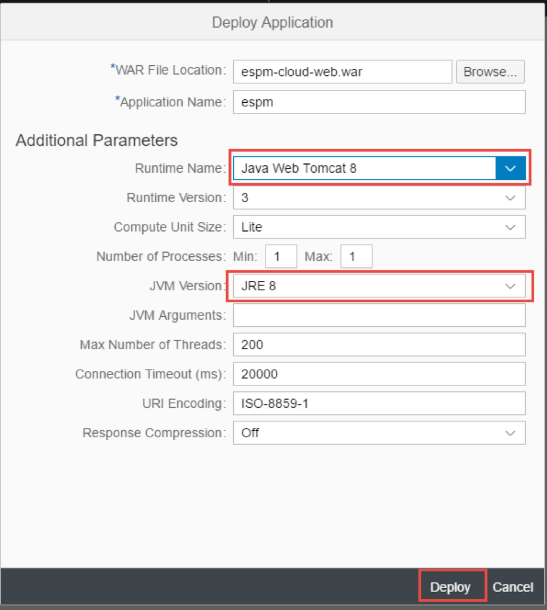
3. Wait until the deploy process is finished, but do not start the app yet.

### Setting up Destination for Twitter Integration

1. In SCP Cockpit, click on **Applications** > **Java Applications** > your app (`espm`) > **Configuration** > **Destination**.
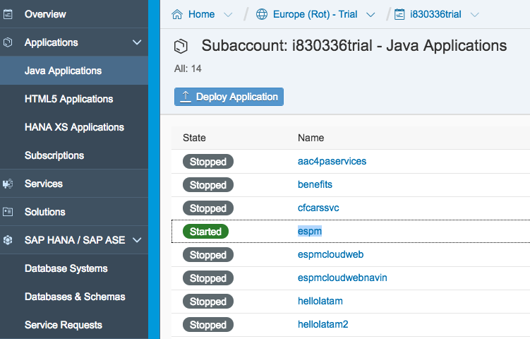
2. Click on **New Destination** and then fill out the form with the following info:

  Field Name         | Value
  ------------------ | ------------------
  Name                                       | `twitterOauth`
  Type                                       | `HTTP`
  URL                                        | `<Any_Website_URL>`
  Proxy Type                                 | `NoAuthentication`
  `consumerApplicationKey` (new property)    | `<Consumer_Key>` (Twitter, step 1)
  `consumerApplicationSecret` (new property) | `<Consumer_Secret>` (Twitter, step 1)
  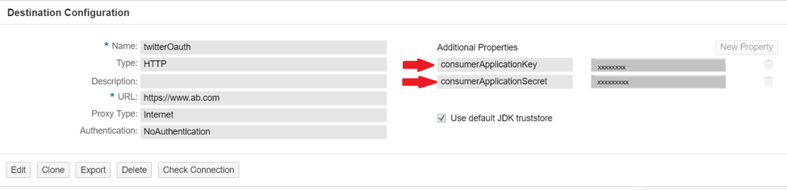
3. Click on **Save**.

### Binding the database to espm application

1. On left menu of SCP cockpit, click on **SAP HANA / SAP ASE** > **Databases & Schemas**.
2. Click on the new button
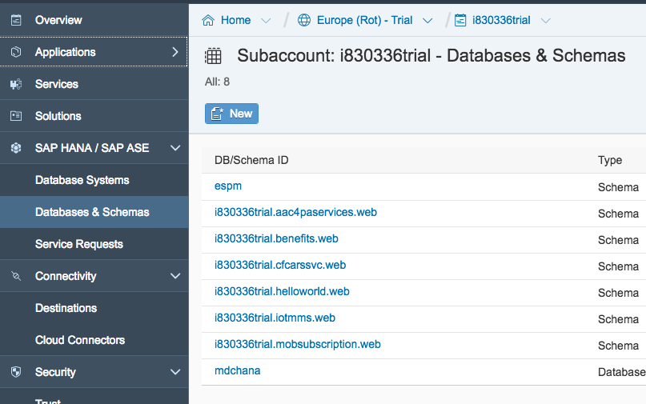
3. In the pop-up window, enter the **Schema ID** as `espm` and leave the **Database System** as `HANA <shared>`.
4. Click on **Save**.
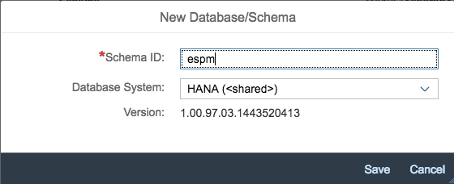
5. Go back to the main cockpit page, then click on **Applications** > **Java Applications** > your app (`espm`) > **Configuration** > **Data Source Bindings**.

6. Click on **New Binding**.
7. In the pop-up window, set the **DB/Schema ID** as `espm`, then click on **Save**.
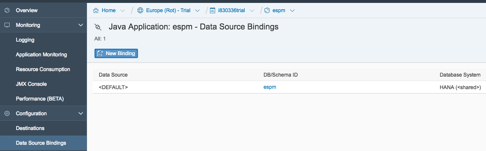

### Testing your application

1. In the context menu on the left, click on **Overview**.
2. Click on **Start** and wait until the status changes to **Started**.
3. Click on the **Application URL**.
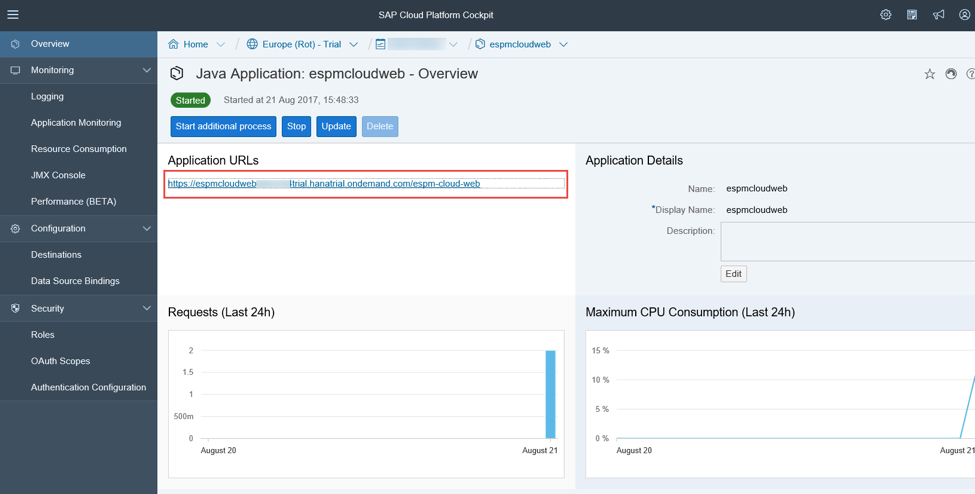
4. You will be authenticated with your Twitter credentials. If you are already logged in, you will see a Twitter screen informing that you will be redirected, otherwise enter your Twitter credentials.
5. Add a product to your chart.
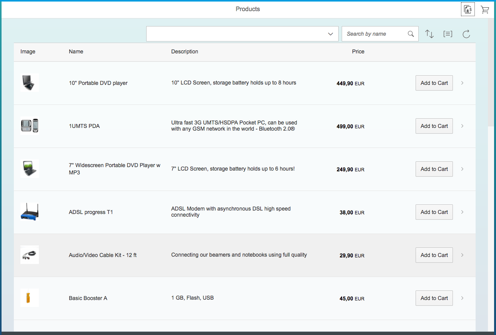
6. Click on the chart icon.
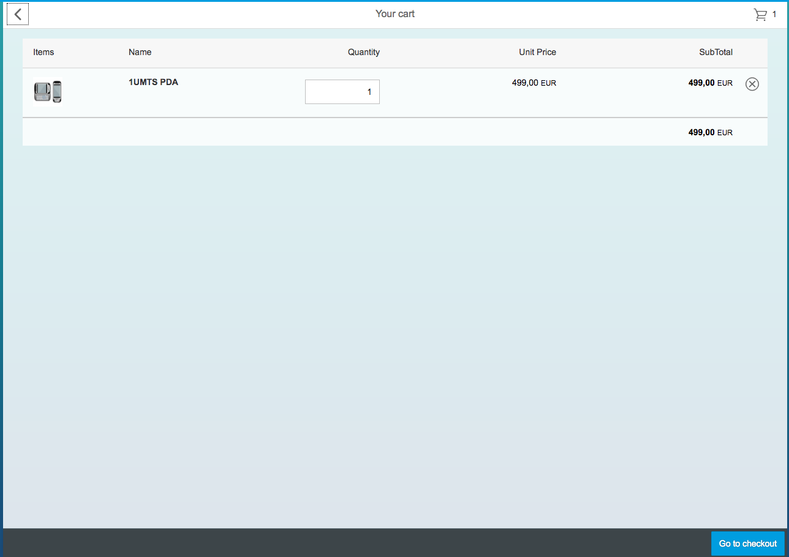
7. Click on **Go to checkout**. Press **Step 2** and fill out all the fields, then click on **Step 3**.
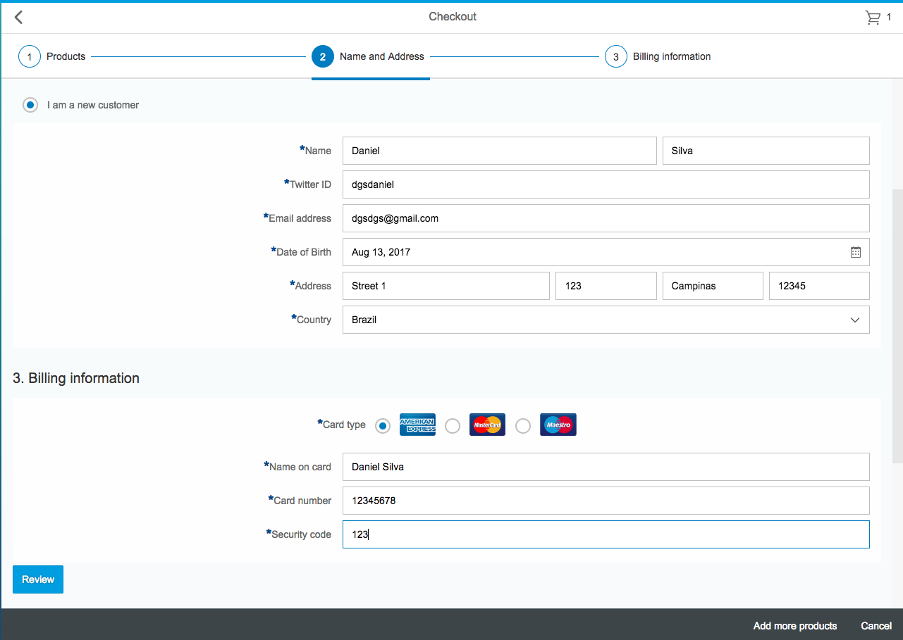
8. Click on **Review**, then **Place an order**.
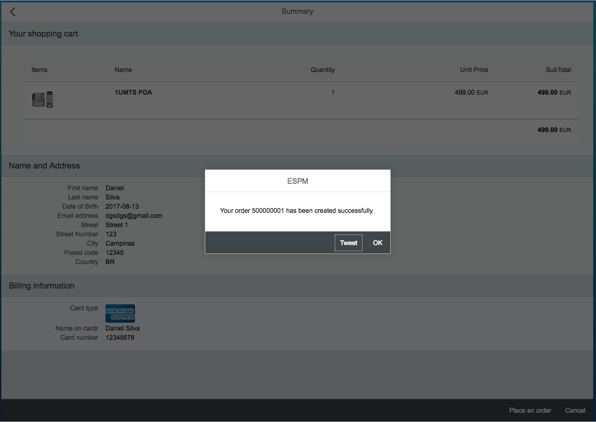
9. Click on Tweet and check in your Twitter page your app's tweet.
